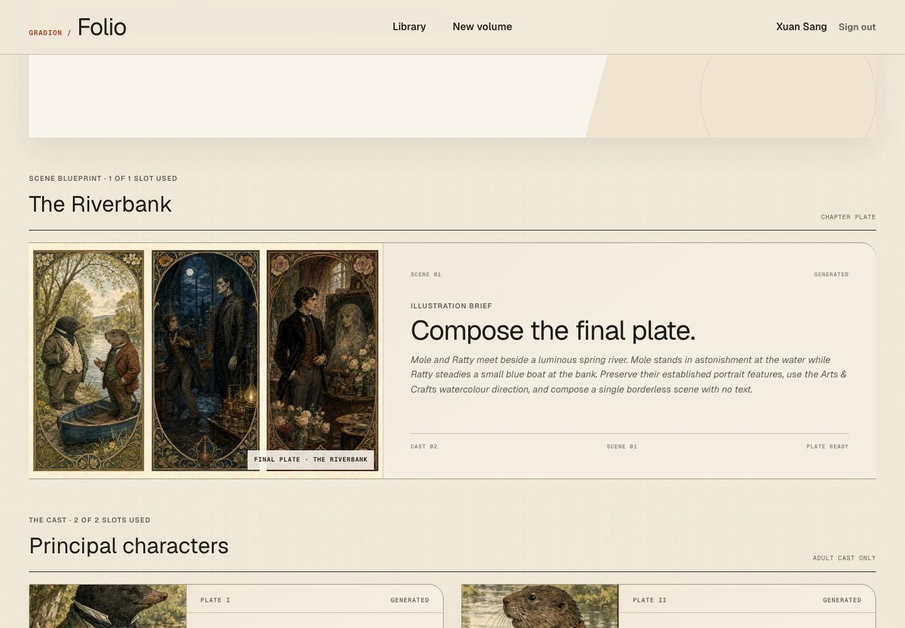
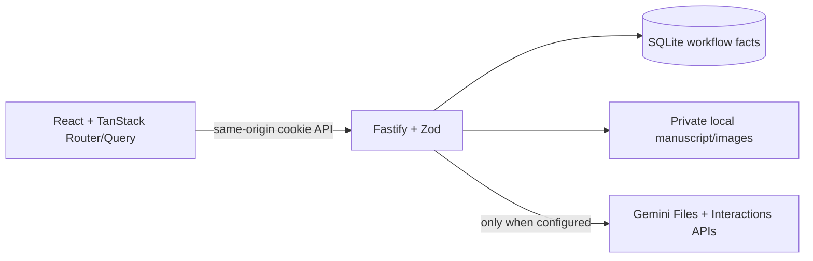

# Gradion Folio Book Studio

**Folio** is a local-first editorial studio that transforms one plain-text manuscript into a consistent illustrated volume. A user explicitly advances the book through five persisted stages: art direction, adult-character extraction, character portraits, a chapter brief, and one final illustration.



> **Reviewer status — 14 August 2026**  
> The required local, single-host implementation and deterministic verification are complete. The keyless suite passes **144 tests**, both npm audits report **0 vulnerabilities**, and the built application passes its route/private-data smoke checks. A paid Gemini image UAT is still pending: the official-notebook preflight successfully reached text generation, but the account's first image request returned HTTP 429 because its free-tier image quota was `0`. No successful live portrait/final-image generation is claimed.

## What this submission demonstrates

- A polished React interface preserved from the approved prototype without a second redesign.
- A real Fastify API; browser state and `localStorage` are not the production database.
- Durable SQLite workflow state that survives refresh, sign-out, tabs, and backend restart.
- Private filesystem ownership for the canonical manuscript and generated image bytes.
- Atomic step claiming, leases, heartbeat extension, recovery, explicit retry, and stale-run fencing.
- One-time manuscript upload with persisted Gemini context; later stages do not resend the manuscript.
- Per-portrait checkpoints: if portrait two fails, portrait one stays saved and is not regenerated.
- Server-enforced limits of at most two adult characters and exactly one chapter.
- No hidden Gemini retry and no automatic model fallback that could unexpectedly spend quota.
- A deterministic fake-provider integration path plus transport-level compatibility tests that make the default test suite free and repeatable.

## Reviewer quick start

### Requirements

- macOS or Linux
- Node.js **22.23.2 or newer**
- npm **10 or newer**
- No Docker or external database
- A Gemini API key with paid image access only if testing real generation

### Option A — inspect the product without a Gemini key

This is the fastest, zero-cost review path:

```bash
npm ci
cp .env.example .env
./start.sh
```

Open **http://127.0.0.1:3001**.

Leave `GEMINI_API_KEY=` empty. The complete application, identity flow, Library, project creation, manuscript storage, Studio states, database, and health checks remain available. Starting a generation step fails safely and visibly with `GEMINI_NOT_CONFIGURED`; the server does not crash.

Run the complete deterministic verification gate separately:

```bash
./test.sh
```

`./test.sh` deliberately clears `GEMINI_API_KEY`, uses temporary SQLite/filesystem locations, makes no Gemini request, and cleans up after itself.

### Option B — test real Gemini generation

Create a key in [Google AI Studio](https://aistudio.google.com/app/api-keys), enable paid access for the project, then edit the repository-root `.env`:

```env
GEMINI_API_KEY=replace_with_your_key
GEMINI_TEXT_MODEL=gemini-3.6-flash
GEMINI_IMAGE_MODEL=gemini-3.1-flash-image
```

Restart the application:

```bash
./start.sh
```

Confirm that the backend sees the key without exposing it:

```bash
curl http://127.0.0.1:3001/api/health/ready
```

The response should contain `"geminiConfigured": true`. The configured image model has no free API tier; billing and active quota are required. Use a short public-domain, non-sensitive `.txt` manuscript for a bounded manual run. Never put the key in frontend code, screenshots, terminal transcripts, documentation, or Git.

## Suggested five-minute walkthrough

1. On the entry screen, provide a name and email. This is a deliberately lightweight local identity—not verified public authentication.
2. In **Library**, inspect empty/status/progress states and open **New volume**.
3. Create a project by either uploading one valid UTF-8 `.txt` file or pasting text.
4. Open the volume and read the complete stored manuscript from the Studio.
5. Run only the current stage. The server rejects out-of-order execution.
6. While a step runs, refresh or open the same project in another tab. The second request observes the existing attempt instead of starting duplicate provider work.
7. Inspect the named failed, retry, stuck, recovery, per-portrait, and completed states covered in the visual and automated evidence.
8. Sign out, sign back in with the same normalized email, and confirm that the persisted Library returns.

## Product flow

| Stage | User-visible result | Persistence and context rule |
| --- | --- | --- |
| **I. Style** | selected or generated art direction | upload the source and create the book context once |
| **II. Characters** | one or two validated adults | continue from the stored text interaction; server and DB enforce the cap |
| **III. Portraits** | one independently saved image per adult | use a sequential image context; retry only missing/failed portraits |
| **IV. Chapter** | one validated chapter brief | continue from the terminal character-text interaction |
| **V. Illustration** | one final chapter illustration | fresh request containing the effective style, chapter brief, and only referenced local portraits |

The browser cannot skip stages, raise product caps, mark a step complete, or publish an artifact. Those invariants are enforced in shared contracts, the backend domain layer, and SQLite constraints.

## Architecture



Fastify serves the production SPA and `/api` from one loopback origin. SQLite owns users, sessions, projects, five step rows, attempts, leases, fences, provider-operation metadata, character/chapter records, and artifact associations. The private filesystem owns the canonical text and image bytes. Only authenticated, owner-scoped API routes stream those bytes.

The implementation is production-ready **for the assignment's specified local, single-host boundary**. It does not claim horizontal or public internet operation. Moving to multiple hosts would require a shared transactional database, object storage, and durable cross-process job coordination.

See [docs/architecture.md](docs/architecture.md) for the claim/recovery and provider-context diagrams.

## Repository layout

```text
.
├── frontend/                 React, Vite, Tailwind, TanStack Router/Query
│   ├── public/               decorative prototype fixtures only
│   └── src/                  routes, product features, API client, styles
├── backend/                  Fastify API and local runtime
│   ├── src/database/         SQLite client and versioned migrations
│   ├── src/identity/         local session continuity and owner scoping
│   ├── src/integrations/     Gemini gateway and local file storage
│   ├── src/pipeline/         state machine, claims, fencing, step executor
│   ├── src/projects/         projects, manuscript and artifact services
│   ├── src/routes/           session, projects, pipeline, artifacts, health
│   └── tests/                domain, integration, transport and operations
├── packages/contracts/       browser-safe Zod DTOs and product constants
├── scripts/                  runtime checks and built-server smoke tooling
├── docs/                     architecture, baseline, AI and submission evidence
├── data/                     ignored local runtime data; created on first run
├── start.sh                  build and start the complete local application
└── test.sh                   deterministic clean verification gate
```

## Important engineering guarantees

### Backend-authoritative state

The frontend reads typed API DTOs through TanStack Query. SQLite—not React state, timers, or `localStorage`—is the source of truth. Polling occurs only while a persisted step is running and stops after terminal state or unmount.

### Duplicate prevention and ordering

A short atomic SQLite claim allows only the first incomplete stage to start. Provider work occurs outside the database transaction. A concurrent request that finds a live lease receives the existing running state and performs no Gemini operation. Every partial and terminal write verifies the active attempt ID; a late abandoned runner cannot overwrite a recovered attempt.

### Explicit Retry and Recover

- A provider or model-validation failure persists as `failed`.
- **Retry** is a deliberate user action and creates the next attempt.
- A running step with an expired lease is derived as `stuck`.
- **Recover** abandons the expired attempt and produces a failed, retryable state.
- Recover performs zero provider calls and preserves completed stages/items.

There is intentionally no transport retry and no model fallback. If Gemini accepted work immediately before process death, a later explicit retry may still incur another upstream operation; local fencing guarantees data integrity, not exactly-once external billing.

### One source, reused context

Stage I uploads the canonical source once and persists the remote file reference and book interaction. Text stages continue through stored interaction IDs. Portraits use a separate sequential image chain. Stage V is a fresh request using the persisted style, one chapter brief, and only the locally saved portraits referenced by that chapter. It does not resend the manuscript or continue the portrait chain.

### Partial item durability

Portrait artifacts are validated, saved, and associated one at a time. If portrait one succeeds and portrait two fails, the first file remains visible. Retry reconciles existing checkpoints and requests only the missing/failed portrait.

## API overview

All project and artifact routes require the opaque local session cookie. A foreign or unknown resource resolves as a generic not-found response.

| Method | Route | Purpose |
| --- | --- | --- |
| `POST` | `/api/session` | create or resume a local identity |
| `GET` | `/api/session` | restore the current session |
| `DELETE` | `/api/session` | end the current session |
| `GET` | `/api/projects` | owner-scoped Library |
| `POST` | `/api/projects` | create from pasted text or multipart `.txt` |
| `GET` | `/api/projects/:projectId` | complete persisted Studio DTO |
| `GET` | `/api/projects/:projectId/manuscript` | readable canonical manuscript |
| `POST` | `/api/projects/:projectId/steps/:ordinal/run` | claim and run the current stage |
| `POST` | `/api/projects/:projectId/steps/:ordinal/recover` | recover an expired attempt without generation |
| `GET` | `/api/projects/:projectId/characters/:characterId/portrait` | authenticated portrait stream |
| `GET` | `/api/projects/:projectId/chapters/:chapterId/illustration` | authenticated final-image stream |
| `GET` | `/api/health/live` | process liveness |
| `GET` | `/api/health/ready` | DB, migrations, filesystem and non-secret Gemini readiness |

## Commands

Run these from the repository root:

| Command | Purpose |
| --- | --- |
| `npm ci` | deterministic dependency installation from the lockfile |
| `./start.sh` | build contracts/frontend/backend and serve the complete app on port 3001 |
| `npm run dev` | Vite HMR on port 3000 plus Fastify watch mode on port 3001 |
| `./test.sh` | keyless typecheck, lint, unit/integration tests, build, audits and smoke test |
| `npm run typecheck` | type-check all three workspaces |
| `npm run lint` | lint contracts, frontend, backend and operational scripts |
| `npm test` | run frontend and backend Vitest suites |
| `npm run build` | create all production outputs |
| `npm run visual:after` | recapture the 15 desktop/mobile visual states; requires local Chromium/app |
| `npm run visual:compare` | regenerate human-inspection pixel evidence |

Development URLs:

- Frontend with HMR: `http://localhost:3000`
- Fastify API: `http://127.0.0.1:3001`
- Built single-origin release: `http://127.0.0.1:3001`

## Environment reference

The backend reads `.env` from the repository root; explicit process variables take precedence.

| Variable | Default | Purpose |
| --- | --- | --- |
| `NODE_ENV` | `development` | runtime mode; `start.sh` uses production composition |
| `HOST` | `127.0.0.1` | bind address; production permits loopback only |
| `PORT` | `3001` | Fastify/built-app port |
| `LOG_LEVEL` | `info` | structured log level |
| `DATABASE_PATH` | `./data/folio.sqlite` | private SQLite database |
| `DATA_DIR` | `./data` | private canonical source and image root |
| `GEMINI_API_KEY` | empty | backend-only key; optional at boot, required for real generation |
| `GEMINI_TEXT_MODEL` | `gemini-3.6-flash` | text/context model |
| `GEMINI_IMAGE_MODEL` | `gemini-3.1-flash-image` | portrait and final illustration model |
| `GEMINI_REQUEST_TIMEOUT_MS` | `120000` | timeout for one provider request |
| `STEP_LEASE_MS` | `180000` | running-step lease duration |
| `HEARTBEAT_MS` | `30000` | lease extension; must be less than half the lease |
| `SESSION_TTL_SECONDS` | `604800` | local identity-session lifetime |
| `MAX_SOURCE_BYTES` | `5242880` | manuscript byte limit |
| `MAX_IMAGE_BYTES` | `15728640` | generated-image byte limit |
| `COOKIE_NAME` | `folio_session` | opaque session-cookie name |

## Testing and evidence

The default suite is deliberately provider-free and deterministic:

| Layer | Current evidence |
| --- | --- |
| Shared contracts/frontend | 10 files, 38 tests |
| Backend/domain/integration/transport | 16 files, 106 tests |
| Total | **26 files, 144 tests** |
| Security audits | production and full npm audit: **0 vulnerabilities** |
| Browser evidence | 15 desktop/mobile screenshots; **41/41 assertions** |
| Browser runtime errors | 0 console errors, 0 page errors, 0 unexpected requests |
| Built release | direct SPA routes, JSON API 404s and private-data isolation smoke-tested |

High-signal backend cases include:

- two simultaneous Run requests produce one winning provider sequence;
- skipped/out-of-order stages produce no provider operation;
- live duplicate, expired lease, Recover, explicit Retry and stale-token fencing;
- restart persistence and returning-email continuity;
- one successful portrait surviving a second portrait failure;
- retry-only-missing behavior;
- exactly one source upload in the fake five-stage run;
- malformed/over-cap/non-adult structured output rejection;
- artifact path, MIME, magic-byte and owner-isolation validation;
- one controlled HTTP 429 producing exactly one outgoing request with no fallback.

See [TESTING.md](TESTING.md) for exact command output, clean-room rehearsal, deliberate omissions, and the honest live-provider status. Visual files are in [`docs/baseline/after`](docs/baseline/after/).

## Local data, privacy, and security

```text
data/
├── folio.sqlite
└── users/<userId>/projects/<projectId>/
    ├── source/book.txt
    ├── portraits/
    └── illustrations/
```

- `.env`, `data/`, SQLite sidecars, temporary uploads, and build outputs are ignored.
- Manuscripts and generated images are not exposed through the static frontend.
- Server-generated relative paths are resolved under the private data root and validated before access.
- Artifact routes are owner-scoped and return `private` cache semantics with `nosniff`.
- Session tokens are random and opaque; only hashes are stored in SQLite.
- Cookies are finite-lived, HttpOnly, `SameSite=Lax`, `Path=/`, and Secure only under HTTPS.
- Mutating cookie-authenticated requests are same-origin protected.
- Logs redact keys, cookies, authorization data, manuscript/prompt text, raw provider responses and image bytes.
- The API key never enters the browser bundle.

The name/email entry is intentionally only identity continuity for a local assessment. It does not verify email ownership and must not be represented as public authentication.

When real generation is enabled, source content is sent to Google's Files and Interactions APIs. Review the provider's current retention/data terms and use non-sensitive, public-domain input. Decorative files in `frontend/public/illustrations/` are approved prototype fixtures, not evidence of the current Gemini adapter; their per-file provenance still requires candidate confirmation before submission.

## Troubleshooting

### The server starts, but generation says Gemini is not configured

Add the key only to the root `.env`, restart `./start.sh`, and check `/api/health/ready`. A successful readiness response reports `geminiConfigured: true` without exposing the key.

### `MODEL_ACCESS_DENIED`

The selected Google project does not have access to the configured model, or billing/model availability is missing. Fix the project access and explicitly Retry. The application will not silently switch models.

### `QUOTA_EXCEEDED` / HTTP 429

The failed step is persisted after one request. Wait for quota, enable the required paid image access, or adjust quota, then click Retry. Repeated browser clicks do not create automatic transport retries.

### `CONTEXT_EXPIRED`

Local work remains intact. The core assignment deliberately does not silently re-upload the source or rebuild remote context because that would add hidden provider operations and cost.

### A step is stuck

Wait until the lease is expired, click **Recover**, then click **Retry**. Recover performs no Gemini request.

### Native SQLite installation fails

Confirm the supported Node version, remove the incomplete local install if necessary, and rerun `npm ci`. Do not change the database implementation to bypass the toolchain requirement.

### Port 3001 is occupied

Set another loopback port before starting:

```bash
PORT=3101 ./start.sh
```

## Intentional scope and limitations

- Local loopback application only; no public deployment is part of the submission.
- No passwords, OAuth, email verification, RBAC, or public multi-user authentication.
- No Docker, Redis, queue, cloud database, cloud object storage, WebSocket, or SSE.
- No multi-host execution or distributed exactly-once billing claim.
- No automatic Gemini retry, model fallback, or remote-context rebuild.
- A provider request in flight does not survive server process death; persisted lease/recovery/fencing protects local correctness afterward.
- Static prototype-asset provenance still needs candidate confirmation.
- A successful paid Gemini portrait/final-image UAT remains outstanding.

These constraints are deliberate right-sizing for the assessment, not hidden scalability claims. The natural scale-out boundary is documented in [docs/architecture.md](docs/architecture.md) and [DECISIONS.md](DECISIONS.md).

## Documentation map

| Document | Reviewer value |
| --- | --- |
| [docs/architecture.md](docs/architecture.md) | implemented state, concurrency and Gemini-context diagrams |
| [docs/implementation-plan.md](docs/implementation-plan.md) | detailed requirements, schema, phases and assessment traceability |
| [DECISIONS.md](DECISIONS.md) | six engineering decisions, AI pushback and explicit trade-offs |
| [TESTING.md](TESTING.md) | exact verification evidence, clean-room rehearsal and live-UAT limitation |
| [docs/submission-checklist.md](docs/submission-checklist.md) | remaining candidate-owned actions before submission |
| [docs/ai/README.md](docs/ai/README.md) | genuine AI workflow artifacts and notebook observations |
| [docs/baseline/behavior.md](docs/baseline/behavior.md) | approved behavior/visual inventory |

## Delivery note

The repository is intentionally sufficient for local review: install once, run one command, and use a reviewer-owned key only when real generation is desired. No secret, private manuscript, generated user artifact, public demo URL, or deployment configuration should be committed. Any previously hosted prototype is outside this submission and should be decommissioned by the candidate.
