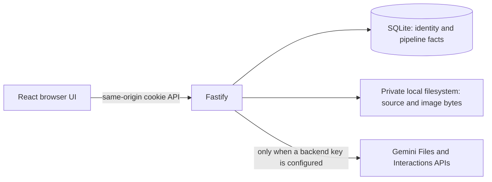
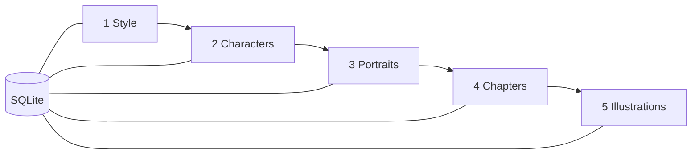
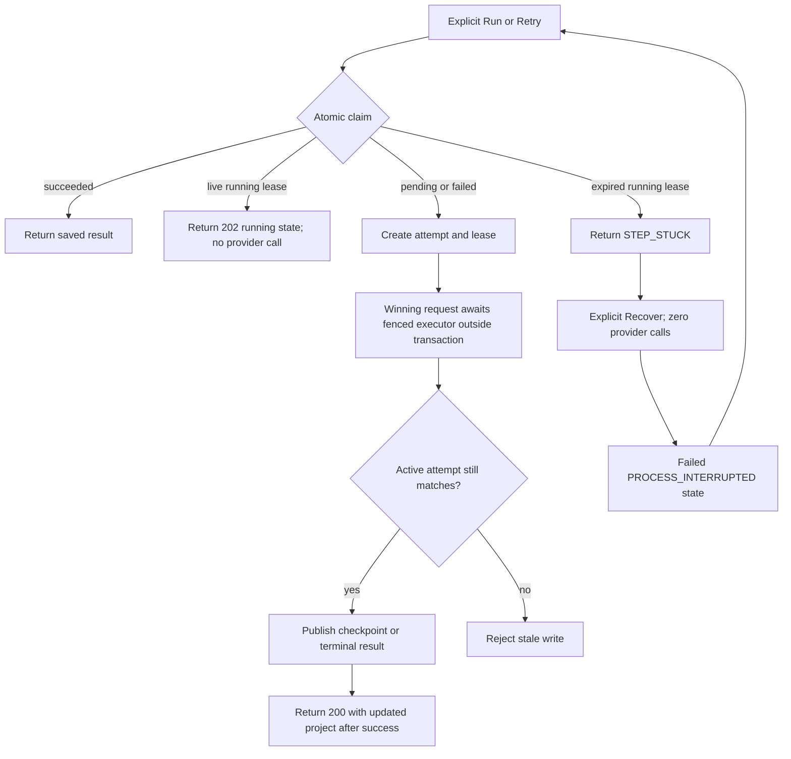
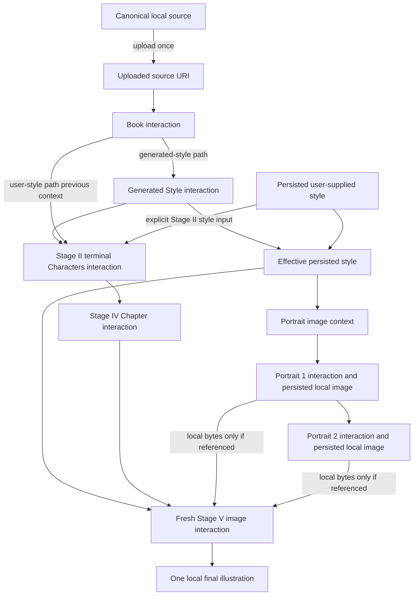

# Architecture evidence

This is the implemented local architecture, not a cloud deployment proposal. Implementation and deterministic verification are complete for the required local, single-host runtime; submission remains blocked pending a successful paid Gemini portrait/final-image UAT.

## Runtime and ownership

Fastify serves the built SPA and `/api` from one loopback origin. SQLite owns identity, projects, step/attempt state, provider-operation metadata, and relative artifact associations. The local filesystem owns canonical manuscript and image bytes. Owner checks happen before artifact reads; neither `data/` nor environment files are static roots.

## Five persisted stages

The server creates exactly five step rows and derives the current stage from the first non-succeeded row. Statuses are persisted as `pending`, `running`, `succeeded`, or `failed`; `stuck` is derived from an expired running lease. The database and domain validators enforce at most two adult characters and one chapter.

Portrait progress is per item: each character has an independent generation status, artifact metadata, and provider interaction. A successful first portrait remains durable if the second fails, and an explicit retry requests only missing or failed portraits.

## Claim, recovery, retry, and fencing

Claims use short SQLite transactions. The winning Run request then awaits the fenced step executor; provider execution occurs outside the transaction. A duplicate request that sees the live lease returns `202` without a provider call. After success the winning request returns `200` with the updated project. Refresh or navigation is not intentionally passed as a Gemini cancellation signal, but execution remains process-local foreground work and is not preserved by server death. Heartbeats extend only the matching attempt lease. Lease expiry, explicit Recover, and explicit Retry are the recovery contract. Recover preserves completed steps/items and performs no generation; fencing prevents an abandoned runner from overwriting a newer attempt.

SIGINT/SIGTERM use a bounded `app.close()` path. Fastify stops accepting new requests, and its `onClose` hook closes heartbeat timers and SQLite. There is no background dispatcher to drain.

## Gemini context ownership

The initial book request contains the instruction and uploaded document URI. With generated style, Stage II continues from the generated Style interaction. With user-supplied style, Stage II continues from the Book interaction and includes the persisted user style explicitly. In both paths, Stage II’s terminal Characters interaction is the previous interaction for Stage IV chapter extraction. Later text operations therefore use stored interaction IDs rather than resending manuscript text.

The effective persisted style creates the portrait image context. Portrait generation is sequential: Portrait 1 follows that context and Portrait 2 follows Portrait 1. Stage V does **not** continue this portrait interaction chain. It creates a fresh image interaction containing the effective style, chapter prompt, and only the locally persisted portrait bytes referenced by the chapter. It does not resend the manuscript.

## Honest operating boundary

Implementation and deterministic verification are complete for the required local, single-host runtime, but submission remains blocked pending a successful paid Gemini portrait/final-image UAT. The application is not horizontally scalable without a shared database, object storage, and durable cross-process job coordination. Atomic claims prevent ordinary duplicate clicks/tabs from starting parallel work, but exactly-once upstream billing cannot be guaranteed if the process dies after Gemini accepts a request and before its response is durably checkpointed. Recovery and fencing preserve local correctness; a later explicit retry may incur another provider operation.
