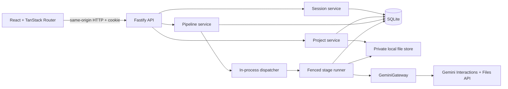

# Folio Book Studio — Production Implementation Plan

> Status: approved UI/workspace migration and Phases 1–4 complete; the frontend API cutover is verified, the real provider adapter is transport-tested, and paid image UAT remains deferred.
>
> Last reviewed: 2026-08-14.
>
> Target: production-ready **for the assessment's local, single-host runtime**, with explicit seams for future horizontal scale. The goal is not to imitate a distributed cloud system inside a 16-hour take-home.

## 1. Executive summary

The repository already has a strong product shell:

- React 19 + Vite + TypeScript frontend
- Tailwind available for new structure while the accepted custom CSS preserves visual parity
- TanStack Router with `/login`, `/library`, `/volumes/new`, and `/volumes/$volumeId`
- Fastify + Zod backend workspace
- desktop/mobile visual baselines and 41 interaction assertions
- clean workspace-level typecheck, lint, tests, and production builds

The accepted browser experience is now server-backed. TanStack Query owns cached API data, route loaders restore the HttpOnly cookie session before protected content renders, and the former `DemoStore`, localStorage snapshot, generation timers, seed projects, and generated-artifact mappings have been removed from production. The backend remains authoritative for durable sessions, projects, manuscripts, the Phase 2 state machine, and the Phase 3 five-stage provider/artifact implementation. The real adapter is composed only for a backend key and is verified against a controlled local transport; a billed end-to-end image run remains pending. Phase 5 release hardening has not started.

The implementation order is deliberate:

1. Freeze domain contracts and build a deterministic test harness.
2. Make identity, projects, manuscript text, and artifacts durable.
3. Prove ordering, duplicate prevention, retry, and recovery with a fake provider.
4. Implement the real Gemini pipeline behind the same provider interface.
5. Replace the demo store with typed server state without redesigning the UI.
6. Harden local operation, produce the required evidence, and run one bounded real pipeline.

The most important engineering signal is not the number of abstractions. It is that concurrency and recovery behavior are written as invariants and proven by tests.

## 2. Scope and success criteria

### 2.1 Required product behavior

- A name and normalized email create or resume an identity.
- Each identity can access only its own projects.
- A project is created from a title and exactly one source: pasted text or one UTF-8 `.txt` file.
- The full manuscript remains readable throughout the pipeline.
- The five Gemini stages run explicitly, one at a time, in order.
- The server enforces at most two adult characters and one chapter.
- Refresh, logout, a second tab, and process restart do not erase completed work.
- Duplicate clicks/tabs share one active attempt and do not create a second Gemini call sequence.
- A failed step is retryable without changing completed steps.
- An expired running lease is visibly stuck and can be explicitly recovered.
- Portraits persist individually; portrait one remains visible if portrait two fails.
- The manuscript is uploaded/sent to Gemini once per provider context and reused later.
- No network, SDK, or application loop automatically retries a billed generation.
- Book text and generated images live on the private local filesystem and are served through owner-checked API routes.
- One command starts the full local product; one command verifies it without an API key.

### 2.2 Definition of “production-ready” for this repository

Production-ready here means:

- strict runtime configuration validation
- durable migrations and restart-safe state
- short atomic database claims around expensive work
- fencing against late/stale writes
- server-side authorization and input validation
- atomic filesystem writes and safe path handling
- typed provider and API errors
- secrets and sensitive text redacted from logs
- graceful shutdown and actionable health/readiness checks
- deterministic unit/integration tests using a fake Gemini gateway
- an honest record of known failure windows and single-host limitations

It does **not** mean public deployment, Kubernetes, Redis, a distributed queue, S3, OAuth, event sourcing, or microservices. Those would conflict with the brief or add operational surface without improving the assessed behavior.

### 2.3 Non-goals

- No public deployment or continuous delivery.
- No Veo, Lyria, TTS, audiobook, or later notebook sections.
- No unbounded character/chapter generation.
- No automatic Gemini retry or automatic model fallback.
- No visual redesign or wholesale conversion of the accepted CSS to Tailwind.
- No generic workflow engine.
- No real proof of email ownership; the brief intentionally requests lightweight identity.
- No cross-region or multi-host guarantee while SQLite and local files are the storage contract.

## 3. Current-state audit and delivered replacement

| Area | Pre-Phase 1/4 implementation | Delivered implementation |
| --- | --- | --- |
| Identity | Browser fields stored in `DemoStore` | Server session cookie + normalized user record; route-loader restoration |
| Project ownership | Client-side email filter | Owner-scoped SQL on every route |
| Project storage | `localStorage` seed snapshot | SQLite + private source file |
| Pipeline | `setTimeout`, sample text, static images | Persisted state machine + Gemini gateway |
| Duplicate prevention | One browser's `running` flag | Atomic database claim shared by all tabs |
| Failure/recovery | Demo-only state branches | Persisted typed failures, leases, fencing, recovery |
| Image progress | Simulated counter | Per-character durable checkpoints |
| Upload | Browser reads file contents | Stream/validate/store on backend |
| Generated assets | Title/index mapped to public fixtures | Authenticated artifact API |
| API | Health route only | Session, projects, steps, manuscript, artifact routes |
| Tests | UI migration + a few unit tests | Pipeline, persistence, integration, and focused server-state UI tests |
| Docs | Runtime migration record | README, architecture, decisions, testing report, AI artifacts |

The migration history remains in [`migration-record.md`](./migration-record.md). The visual baseline remains a regression aid, not a pixel-perfect CI gate, because recorded scroll offsets produce noisy raw image differences.

## 4. Engineering principles

1. **The backend is authoritative.** Browser storage never owns user, project, step, or artifact state.
2. **Store facts, derive summaries.** Do not store redundant `completedSteps`, `currentStep`, or overall status fields that can drift.
3. **Claims are atomic; provider work is not transactional.** Never keep a SQLite transaction open during Gemini or filesystem I/O.
4. **Every expensive write is fenced.** Only the currently active attempt token may publish context, items, artifacts, success, or failure.
5. **Retry is a user action.** A provider error persists a failed attempt. Recovery only clears an expired lease; it never generates content.
6. **Completed items are immutable checkpoints.** Retrying a step generates only missing items.
7. **Configuration controls deployment concerns; code controls product invariants.** Models, paths, timeouts, and ports are configurable. The five steps and 2/1 caps remain versioned product rules.
8. **Prompts are versioned source code.** They are reviewed and tested, not hidden in environment variables or spread through route handlers.
9. **One provider boundary.** Domain and HTTP code never import the Google client directly.
10. **Scale by replacing adapters, not rewriting the product.** Keep small, intentional seams around DB access, files, IDs/clock, and Gemini.

## 5. Target architecture



### 5.1 Runtime model

- Development: Vite on `localhost:3000`, Fastify on `127.0.0.1:3001`, Vite proxies `/api`.
- Local release: Fastify serves `frontend/dist` and `/api` from one loopback origin with SPA fallback.
- Pipeline run requests return `202 Accepted` after an atomic claim; an in-process dispatcher performs provider work independently of the browser request lifecycle.
- The frontend polls project detail only while a step is running.
- Browser refresh does not cancel the in-process run.
- Process death stops in-flight foreground provider work. The persisted lease eventually exposes a stuck step; explicit recovery and retry continue without deleting completed artifacts.

This is deliberately stronger than a long browser-held POST and much smaller than introducing an external queue.

### 5.2 Proposed repository shape

```text
Gradion-Folio-Book-Studio/
├── frontend/
│   └── src/
│       ├── components/
│       ├── features/
│       ├── lib/
│       │   ├── api/
│       │   ├── query/
│       │   └── validation/
│       └── routes/
├── backend/
│   ├── src/
│   │   ├── config/
│   │   ├── db/
│   │   │   ├── migrations/
│   │   │   └── queries/
│   │   ├── domain/pipeline/
│   │   ├── integrations/gemini/
│   │   ├── routes/
│   │   ├── services/
│   │   ├── storage/
│   │   └── app.ts
│   └── tests/
│       ├── integration/
│       └── unit/
├── packages/
│   └── contracts/
├── docs/
│   ├── ai/
│   ├── architecture.md
│   ├── implementation-plan.md
│   └── migration-record.md
├── data/                 # ignored; runtime-created
├── DECISIONS.md
├── TESTING.md
├── AGENTS.md
├── .env.example
├── start.sh
└── test.sh
```

### 5.3 Dependency injection boundary

`buildApp` must accept a small service container:

```ts
type Services = {
  config: AppConfig;
  database: Database;
  files: LocalFileStore;
  gemini: GeminiGateway;
  clock: Clock;
  ids: IdGenerator;
  dispatcher: PipelineDispatcher;
};
```

Production builds one real container. Tests build isolated containers with a temporary database/data directory, fake clock, deterministic IDs, and fake Gemini. Avoid module-level environment reads or global database singletons because they make integration tests leak state.

## 6. Shared contracts and anti-hardcode strategy

Create `packages/contracts` for browser-safe Zod schemas and constants used by both workspaces.

### 6.1 Central pipeline definition

Define the five stages once:

```ts
export const PIPELINE_STEPS = [
  { ordinal: 1, key: "style", label: "Style" },
  { ordinal: 2, key: "characters", label: "Characters" },
  { ordinal: 3, key: "portraits", label: "Portraits" },
  { ordinal: 4, key: "chapters", label: "Chapters" },
  { ordinal: 5, key: "illustrations", label: "Illustrations" },
] as const;

export const MAX_ADULT_CHARACTERS = 2;
export const MAX_CHAPTERS = 1;
```

The UI stepper, route schemas, server validation, database seed rows, and tests import these definitions. Database `CHECK` constraints independently enforce the caps. Adding a sixth step should require one definition, one handler, a migration, and tests—not a rewrite of routes or UI state.

### 6.2 Values that belong in configuration

| Environment variable | Purpose | Suggested local default |
| --- | --- | --- |
| `NODE_ENV` | Runtime mode | `development` |
| `HOST` | Bind address | `127.0.0.1` |
| `PORT` | Fastify port | `3001` |
| `DATABASE_PATH` | SQLite file | `./data/folio.sqlite` |
| `DATA_DIR` | Private source/artifact root | `./data` |
| `GEMINI_API_KEY` | Backend-only provider secret | empty/optional at boot |
| `GEMINI_TEXT_MODEL` | Current text model | verified before implementation |
| `GEMINI_IMAGE_MODEL` | Current image model | verified before implementation |
| `GEMINI_REQUEST_TIMEOUT_MS` | Provider timeout | e.g. `120000` |
| `STEP_LEASE_MS` | Running lease length | e.g. `180000` |
| `HEARTBEAT_MS` | Lease extension interval | e.g. `30000` |
| `SESSION_TTL_SECONDS` | Local identity continuity | e.g. 7 days |
| `MAX_SOURCE_BYTES` | Manuscript byte limit | e.g. 5 MiB |
| `MAX_IMAGE_BYTES` | Generated image byte limit | e.g. 15 MiB |
| `LOG_LEVEL` | Structured logging level | `info` |
| `COOKIE_NAME` | Session cookie name | `folio_session` |

Validate all configuration once with Zod. Validate relationships as well: heartbeat must be less than half the lease; paths must resolve; production must not bind publicly by accident; timeouts and sizes must be positive and bounded.

The app may boot without `GEMINI_API_KEY` so reviewers can run tests and inspect the UI. A real generation attempt without a key returns a typed configuration error. Never expose the key or model configuration in the frontend bundle.

### 6.3 Values that must remain product constants

- exactly five assessment steps
- two adult characters maximum
- one chapter maximum
- allowed manuscript source modes
- allowed image MIME types
- error/status enums
- prompt/schema versions

Making these environment variables would weaken the server-side contract and make test results environment-dependent.

### 6.4 Versioned prompts

Each stage owns a prompt module with:

- stable prompt ID, e.g. `characters.v1`
- system instruction
- input builder
- structured output schema where applicable
- output validator
- model/generation settings

Persist prompt version and actual model ID with every attempt. Do not store arbitrary editable prompt blobs in environment variables. Manuscript content must be wrapped and described as untrusted source material so text inside the book cannot override the system task.

## 7. Persistence model

Use SQLite with `foreign_keys=ON`, WAL mode, a busy timeout, prepared statements, and versioned transactional migrations. Direct, focused query modules are preferable to introducing a generic ORM/repository framework for eight small tables.

All timestamps are UTC epoch milliseconds. All public IDs are server-generated UUIDs. Foreign keys cascade from user/project where appropriate.

### 7.1 Tables

#### `schema_migrations`

- `version` primary key
- `applied_at`

#### `users`

- `id` primary key
- `email_normalized` unique, lowercase/trimmed
- `email_display`
- `name`
- `created_at`, `updated_at`

Policy: returning identity updates the display name while retaining the same user and projects. Document that email-only identity is continuity, not verified authentication.

#### `sessions`

- `token_hash` primary key
- `user_id` foreign key
- `created_at`, `expires_at`

Generate a random 32-byte opaque token, place the raw value only in an HttpOnly cookie, and store its SHA-256 hash. Index expiry for cleanup.

#### `projects`

- `id`, `user_id`
- `project_number` unique per user
- `title`
- `source_path`, `source_original_name`, `source_sha256`
- `source_bytes`, `source_words`
- `gemini_file_name`, `gemini_file_uri`, `gemini_file_expires_at`
- `book_interaction_id`
- `style_text`, `style_source` (`user` or `generated`)
- `created_at`, `updated_at`

Do not store `status`, `currentStep`, or `completedSteps`; derive them from step rows:

- `Done`: all five steps succeeded
- `Draft`: no step has ever been attempted
- `In progress`: every other state, including failed or stuck Stage I

Assign `project_number` inside an immediate transaction; never derive `VOL. xx` from a client array length.

#### `pipeline_steps`

- composite primary key: `project_id`, `ordinal`
- `key`
- `status`: `pending | running | succeeded | failed`
- `attempt_count`
- `active_attempt_id`
- `started_at`, `heartbeat_at`, `lease_expires_at`, `completed_at`
- `interaction_id` (canonical terminal context for this stage)
- `result_json` for small provider/domain metadata only
- `error_code`, `error_message`
- `updated_at`

`stuck` is derived when `status=running` and `lease_expires_at <= now`; it is not stored as a fifth status.

#### `step_attempts`

- `id` primary key and fencing token
- `project_id`, `step_ordinal`, `attempt_no`
- `status`: `running | succeeded | failed | abandoned`
- `model_id`, `prompt_version`
- `started_at`, `finished_at`, `duration_ms`
- `error_code`, `error_message`
- unique `(project_id, step_ordinal, attempt_no)`

This row provides retry provenance, fencing, and a future attempt-history UI without event sourcing.

#### `provider_operations`

- `id`, `attempt_id`
- `operation_key` such as `source-upload`, `book-context`, `style`, `portrait-0`
- `ordinal` within the attempt
- `status`, `model_id`, `provider_request_id`
- `started_at`, `finished_at`, `duration_ms`
- redacted usage metadata
- `error_code`
- unique `(attempt_id, operation_key)`

This table is justified because one user-visible stage can contain multiple provider operations. It provides cost/call evidence and makes sub-call checkpointing explicit without exposing prompts or manuscript text.

#### `characters`

- `id`, `project_id`
- `position` constrained to `0..1`, unique per project
- `name`, `role`
- `age_group` constrained to `adult`
- `prompt`
- `portrait_status`
- `portrait_path`, `portrait_mime`, `portrait_bytes`, `portrait_sha256`
- `portrait_interaction_id`
- portrait error fields
- timestamps

The database constraint physically limits a project to two positions. Zod validation must require one or two adult outputs and reject, rather than slice, an over-cap response.

#### `chapters`

- `id`, `project_id`
- `position` constrained to `0`, unique per project
- `name`, `prompt`
- `character_names_json`
- `illustration_status`
- `illustration_path`, MIME/bytes/SHA-256
- `illustration_interaction_id`
- illustration error fields
- timestamps

Validate all referenced character names against the stored cast.

### 7.2 Required indexes

- `projects(user_id, created_at DESC)`
- `sessions(expires_at)`
- `pipeline_steps(status, lease_expires_at)`
- `step_attempts(project_id, step_ordinal, attempt_no)`
- `characters(project_id, position)`
- `chapters(project_id, position)`

### 7.3 Filesystem layout

```text
data/
├── folio.sqlite
└── users/<user-id>/projects/<project-id>/
    ├── source/book.txt
    ├── portraits/<character-id>.<validated-extension>
    └── illustrations/<chapter-id>.<validated-extension>
```

Rules:

- never place runtime source/artifacts under `frontend/public`
- use generated IDs, never user filenames, in paths
- store only relative paths in SQLite
- use `path.resolve` + `path.relative` containment checks, not string prefix checks
- write to a sibling temporary file, flush, then atomically rename
- validate image MIME and magic bytes before choosing the extension
- owner-check every artifact request before opening a file
- set `X-Content-Type-Options: nosniff` and private cache headers
- ignore `data/`, SQLite `-wal`/`-shm`, temp files, and local environment files

Project creation cannot be one true transaction across DB and filesystem. Use this order: validate → create private directory → write/flush/rename canonical source → insert project + five steps in one DB transaction → compensate by removing the directory on ordinary DB failure. A crash may leave an orphan directory but must never create a project row pointing at a missing manuscript.

## 8. Pipeline state machine and concurrency

### 8.1 Invariants

1. Exactly one step is the first non-succeeded step.
2. Only that step can be claimed.
3. One live attempt can own a step at a time.
4. A duplicate request never invokes the provider.
5. A succeeded step returns its saved result idempotently.
6. A failed step can be claimed again only by an explicit user action.
7. A running step with an expired lease cannot be retried until explicit recovery abandons the old attempt.
8. Only the active attempt token can publish any partial or terminal write.
9. Completed items/files are never removed by retry or recovery.
10. No provider failure triggers an automatic retry.

### 8.2 Atomic claim algorithm

`POST /api/projects/:projectId/steps/:ordinal/run` performs a short `BEGIN IMMEDIATE` transaction:

1. Load the project with owner scope and all step rows.
2. If the requested row already succeeded, return the existing project DTO (`200`) without a provider call.
3. Compute the first non-succeeded step and reject a different ordinal with `409 STEP_OUT_OF_ORDER`.
4. If it is running with a live lease, return `202` with the current project state; never expose the attempt identifier.
5. If it is running with an expired lease, return `409 STEP_STUCK`; do not reclaim automatically.
6. If it is pending or failed, create a UUID attempt/fencing token, increment the attempt count, insert the attempt row, mark the step running with a lease, and commit.
7. Only the winning request invokes the injected step executor after commit. It returns `200` after success; a duplicate live request returns `202` without an executor call.

No executor/provider await occurs while a SQLite transaction is open. Phase 2 keeps the winning execution in the foreground request but deliberately does not pass the browser request's abort signal into it.

### 8.3 Runner, heartbeat, and fencing

- The runner extends the lease periodically using `WHERE status='running' AND active_attempt_id=?`.
- Clear/unref heartbeat timers in `finally`.
- Every context checkpoint, character/chapter insert, portrait status/path, artifact association, terminal success, and terminal failure first verifies the same active attempt ID.
- A response from an abandoned runner cannot alter visible state.
- Process-local foreground execution does not survive process death. Durable leases make the interrupted step visibly stuck after expiry so the user can recover it explicitly.

### 8.4 Recovery and retry

`POST /api/projects/:id/steps/:ordinal/recover`:

- succeeds only for an expired running lease
- marks the old attempt `abandoned`
- marks the step `failed` with `PROCESS_INTERRUPTED`
- clears the active token and lease
- converts item-level `running` states to retryable failed/pending states
- preserves succeeded items and files
- performs zero Gemini calls

The existing Generate/Retry action then calls the normal run endpoint to create a new attempt.

### 8.5 Partial item reconciliation

Before a Stage III retry in Phase 2:

- read existing character rows
- skip every succeeded portrait checkpoint
- if all required items are already present but the process died before terminal step commit, mark the step succeeded without another provider call
- request only missing/failed portrait items from the fake executor

Stage V recovery resets only in-progress illustration rows. Phase 3 now performs validated illustration generation/storage and reconciles an already-associated valid final artifact without another provider call.

### 8.6 Honest exactly-once limitation

The system prevents duplicate claims from refresh, double-click, tabs, and concurrent local requests. It does not claim distributed exactly-once execution. If a future real provider accepts a foreground request and the process dies before its response is durably checkpointed, the local database cannot know whether the provider completed it. Immediate checkpoints, explicit recovery, and fencing prevent stale data corruption, but a later user retry may issue one additional provider operation.

## 9. API design

All request params, bodies, and responses use shared Zod schemas. Every owner-scoped miss returns the same generic `404`, preventing project-ID probing.

### 9.1 Session

- `POST /api/session` — `{ name, email }`; normalize, find-or-create user, issue cookie
- `GET /api/session` — current identity or `401`
- `DELETE /api/session` — revoke session and clear cookie

Cookie: HttpOnly, SameSite=Lax, Path=/, finite Max-Age; Secure only under HTTPS. Validate same-origin `Origin`/`Host` on mutating cookie-authenticated routes.

### 9.2 Projects

- `GET /api/projects` — owner list, status and five-step progress
- `POST /api/projects` — title plus exactly one pasted/file source
- `GET /api/projects/:projectId` — full studio DTO
- `GET /api/projects/:projectId/manuscript` — readable canonical text

Start with a bounded list response. If cursor pagination is added, centralize default/max page sizes in contracts; do not scatter `slice(0, n)` through UI and SQL.

### 9.3 Pipeline

- `POST /api/projects/:projectId/steps/:ordinal/run`
- `POST /api/projects/:projectId/steps/:ordinal/recover`

An optional `artDirection` is valid only for Stage I. Retry reuses `run`; do not create a duplicate retry endpoint.

### 9.4 Artifacts

- `GET /api/projects/:projectId/characters/:characterId/portrait`
- `GET /api/projects/:projectId/chapters/:chapterId/illustration`

Return URLs in DTOs. The frontend must not infer generated image paths from titles, indexes, or completion counts.

### 9.5 Operations

- `GET /api/health/live` — process is alive
- `GET /api/health/ready` — DB opens, migrations are current, data directory is writable, and reports whether Gemini is configured without making a Gemini call

### 9.6 Error envelope

```json
{
  "error": {
    "code": "STEP_STUCK",
    "message": "The running lease expired. Recover this step before retrying."
  },
  "project": {}
}
```

Use stable error codes such as:

- `UNAUTHENTICATED`, `NOT_FOUND`, `VALIDATION_ERROR`
- `STEP_OUT_OF_ORDER`, `STEP_ALREADY_RUNNING`, `STEP_STUCK`
- `GEMINI_NOT_CONFIGURED`, `MODEL_ACCESS_DENIED`, `QUOTA_EXCEEDED`
- `PROVIDER_UNAVAILABLE`, `PROVIDER_TIMEOUT_AMBIGUOUS`
- `SAFETY_BLOCKED`, `NO_IMAGE`, `INVALID_MODEL_OUTPUT`
- `CONTEXT_EXPIRED`, `LOCAL_IO_ERROR`, `PROCESS_INTERRUPTED`

Logs retain redacted technical causes; responses expose safe, actionable messages.

## 10. Gemini integration

### 10.1 Mandatory preflight

The assessment candidate must personally run notebook steps 1–5 and save a short factual mapping in `docs/ai/notebook-observations.md` before any real Gemini adapter implementation begins. Until that happens, treat this as an incomplete gate and do not fabricate observations. Reverify on the implementation day:

- current notebook model defaults and call sequence
- selected text/image model availability and billing for the actual AI Studio project
- Interactions request/response schema for the pinned SDK
- how to disable retries on both Files and Interactions calls
- structured output schema syntax
- reference-image limits and output image extraction
- retention/expiry behavior

Official references:

- [Book illustration notebook](https://colab.research.google.com/github/google-gemini/cookbook/blob/main/examples/Book_illustration.ipynb)
- [Interactions API overview](https://ai.google.dev/gemini-api/docs/interactions-overview)
- [Image generation](https://ai.google.dev/gemini-api/docs/image-generation)
- [Models](https://ai.google.dev/gemini-api/docs/models)
- [Rate limits](https://ai.google.dev/gemini-api/docs/rate-limits)

As of this plan review, official documentation recommends the Interactions API for new work and lists `gemini-3.6-flash` and `gemini-3.1-flash-image` as current stable models. The notebook may choose a cheaper Lite image model. Model IDs must be environment-overridable and recorded per attempt, never hardcoded inside stage/UI components.

Recommended deliberate product decision: use the current stable Flash Image model for stronger multi-reference character consistency, while retaining the notebook's Lite model as an explicit configured alternative. Never fall back automatically, because fallback changes quality and cost invisibly. Record the final choice and notebook deviation in `DECISIONS.md` after the real preflight.

### 10.2 Gateway contract

```ts
interface GeminiGateway {
  uploadSource(input: UploadSourceInput): Promise<UploadSourceResult>;
  createBookContext(input: CreateBookContextInput): Promise<BookContextResult>;
  defineStyle(input: StyleInput): Promise<StyleResult>;
  extractCharacters(input: CharactersInput): Promise<CharactersResult>;
  createImageContext(input: CreateImageContextInput): Promise<ImageContextResult>;
  generatePortrait(input: PortraitInput): Promise<PortraitResult>;
  extractChapter(input: ChapterInput): Promise<ChapterResult>;
  generateIllustration(input: IllustrationInput): Promise<IllustrationResult>;
}
```

Implement:

- `GoogleGeminiGateway` using native `fetch` with explicit timeouts and no retry loop
- `FakeGeminiGateway` with deterministic outputs, call counters, delay gates, malformed output, no-image, provider failure, and partial portrait failure modes

If the SDK cannot demonstrably disable all automatic retries, switch only the real adapter internals to native `fetch`; the domain contract and tests remain unchanged.

### 10.3 Stage mapping

#### Stage I — Style

1. Upload the stored manuscript once through the Files API if no valid file reference exists.
2. Persist file name, URI, and expiry immediately under the active fence.
3. Create and persist the root book interaction.
4. If the user supplied art direction, persist it verbatim and use the book interaction as the next text context; do not spend an unnecessary style-generation call.
5. Otherwise generate style chained from the book interaction and persist style text + interaction ID.

#### Stage II — Characters

- Continue from the Stage I text context.
- Include the chosen style explicitly when needed.
- Request structured JSON for one or two main adults.
- Require `ageGroup: "adult"`, name, role, and a sufficiently detailed portrait prompt.
- Reject children, zero adults, malformed output, and more than two items; never silently truncate.
- Persist the validated cast and terminal interaction ID transactionally.

#### Stage III — Portraits

- Establish/reuse the image context containing the art style.
- Generate portraits sequentially to preserve visual continuity.
- Save and associate each image immediately.
- Persist each character's interaction ID.
- On retry, generate only missing/failed portraits.
- Re-specify response format, MIME, dimensions/aspect, and generation settings on every image call; conversation state does not imply request configuration inheritance.

#### Stage IV — Chapter

- Continue from the Stage II text interaction.
- Request one structured chapter illustration brief.
- Require name, detailed prompt, and references only to stored character names.
- Reject more than one chapter or unknown character references.
- Persist the chapter and terminal text context.

#### Stage V — Illustration

- Use the notebook's portrait-reference path: send the chapter prompt, style, and only the relevant locally stored portrait bytes to a fresh image interaction.
- Do not resend the manuscript.
- Do not mix a transition-chain approach with explicit portrait references unless the notebook preflight proves that exact combination is intended.
- Save and associate exactly one final illustration.

This approach makes local portraits the durable identity references and reduces dependence on an expiring remote image conversation while still following the required characters → portraits → chapter → illustration order.

### 10.4 Structured output and image validation

- Provider JSON schema narrows generation; Zod/domain rules remain authoritative.
- Parse and validate before writing domain rows.
- Validate exactly one expected image output.
- Decode with a byte cap.
- Verify PNG/JPEG/WebP magic bytes and MIME agreement.
- Reject HTML/text masquerading as an image.
- Optionally inspect dimensions to prevent pathological output.
- A safety block or missing image becomes a typed failed attempt, not a fabricated placeholder.

### 10.5 Retry and cost discipline

- Keep the native transport request shape covered by local HTTP contract tests; pin an SDK only if the transport is deliberately replaced later.
- Explicitly disable SDK and transport retries for Files and Interactions requests.
- Add an HTTP-level adapter test: one simulated `429` produces exactly one outgoing request and one failed operation.
- Use explicit timeouts; timeout becomes `PROVIDER_TIMEOUT_AMBIGUOUS` and waits for user action.
- Never automatically switch models.
- Persist source upload count and provider operations so the final report can prove one upload and bounded image generation.
- Default maximum output per successful project remains two portraits plus one illustration.

### 10.6 Provider retention

Treat remote file/interaction state as an expiring cache; local source/artifacts are durable truth. On expiry:

- return `CONTEXT_EXPIRED`
- do not silently upload or regenerate
- preserve completed local results
- optionally provide an explicit, user-confirmed “Rebuild Gemini context” operation as post-core work, showing that it incurs extra calls/cost

Disclose in README that manuscript content is sent to Gemini and provider retention depends on account/tier settings. Recommend public-domain, non-sensitive text for assessment runs.

## 11. Frontend cutover plan

### 11.1 Data layer

Add:

- one typed `ApiClient` with credentials, response parsing, timeout/abort support, and error normalization
- TanStack Query for server cache, invalidation, mutation state, and conditional polling
- centralized query key factories for session, projects, project detail, and manuscript

TanStack Query is justified here because there are multiple routes sharing mutable server state and a running-step poll. Do not replace the accepted component tree with a generic state framework.

TanStack Router compatibility is determined by published peer ranges, not matching version numbers. The verified Phase 4 pair is `@tanstack/router-plugin@1.168.30` with `@tanstack/react-router@1.170.27`; the plugin accepts React Router `^1.170.26`.

### 11.2 Route behavior

- Root/session loader decides login vs library.
- `/login` posts identity and navigates to the existing Library screen.
- `/library` loads only owner-scoped server projects and renders real empty/loading/error states.
- `/volumes/new` keeps the current UI but submits `multipart/form-data` or validated pasted text to the server.
- `/volumes/$volumeId` loads project detail, handles generic 404, and polls about every 1.5 seconds only while the server DTO says a step is running.
- Stop polling on unmount/signout and refetch immediately after a run/recover mutation.

### 11.3 Preserve local UI state only where appropriate

Local React state remains appropriate for:

- open/closed dialogs
- temporary form fields before submit
- focus return targets
- drag state
- optional unsaved art direction

Server state owns:

- identity/session
- project list and status
- manuscript metadata/text
- step status and errors
- characters/chapters
- generated artifact URLs
- active attempt and item progress

### 11.4 Remove simulation without redesign

Delete or development-gate before final submission:

- `DemoStore` as production provider
- `SEED_PROJECTS`, `SAMPLE_STYLE`, `SAMPLE_CHARACTERS`, `SAMPLE_CHAPTER`
- `setTimeout` generation scheduling
- `Date.now()` project IDs
- `completedSteps` as authoritative data
- fixture selection via `projectPlateSrc`
- sample/empty-library controls intended only for prototype review
- visible copy claiming Gemini calls are simulated

Decorative illustrations and the mascot may remain static product assets. Generated portrait/chapter surfaces must use authenticated API URLs.

### 11.5 Accessibility and UX acceptance

- Existing keyboard dialog/focus behavior must remain.
- Stepper announces one current step until completion.
- Running status names the stage.
- Errors are announced once and retain Retry.
- Stuck state exposes Recover, then Retry.
- Generate actions disable immediately while mutation/step is running.
- Portrait one appears without waiting for portrait two.
- No layout jump from pending to real image dimensions.
- Mobile remains free of document-level horizontal overflow.

## 12. Security, privacy, and operational hardening

### 12.1 Request security

- Use `@fastify/helmet` for security headers.
- Keep one same-origin release; do not add CORS unless architecture changes.
- Validate `Origin`/`Host` on mutations using session cookies.
- Set body and multipart byte limits before buffering.
- Bound and normalize titles, names, emails, and display filenames.
- Use prepared SQL only.
- Return identical 404 responses for missing and foreign-owned resources.

### 12.2 Secret and sensitive-data handling

Redact from structured logs:

- cookies and authorization headers
- `x-goog-api-key`
- request bodies containing manuscript text
- prompt text and provider raw bodies
- image base64

Safe log context includes request ID, hashed/user-safe identifier, project ID, step, attempt, operation key, model, duration, status/error code, output bytes, and usage counts.

### 12.3 Health and shutdown

- Liveness checks process responsiveness only.
- Readiness checks DB, migrations, writable data directory, and reports `geminiConfigured` without spending quota.
- Fastify `onClose` drains/stops the dispatcher and closes SQLite.
- SIGINT/SIGTERM stop new claims and wait a bounded grace period.
- A killed worker relies on persisted lease expiry and explicit recovery.

### 12.4 Observability

Use Fastify/Pino structured JSON logs with a request ID. Record stage/attempt/provider-operation durations and typed outcomes. Do not add an external telemetry backend for the assessment. The `provider_operations` table and redacted logs are sufficient evidence; OpenTelemetry becomes appropriate only after a real multi-service deployment exists.

## 13. Testing strategy

The default suite must use temporary SQLite/data directories and `FakeGeminiGateway`; it must never require a key, internet, or billed calls.

### 13.1 Domain/service tests

Prioritize roughly 18–25 high-signal tests:

- email normalization and returning-user behavior
- owner isolation and generic 404
- project numbering under concurrent creation
- upload/paste exclusivity and validation
- UTF-8, empty, NUL, extension, and byte limits
- strict step ordering
- succeeded-step idempotency
- two concurrent run requests → one claim and one expected fake operation sequence
- live duplicate → existing running state
- failure persistence and explicit retry
- no automatic retry
- lease expiry and early/valid recovery
- stale fencing token cannot write
- app/service recreation against the same DB restores truth
- portrait one checkpoint survives portrait two failure
- retry invokes only the missing portrait
- crash after artifact association reconciles without a new provider call
- one/two adult validation and child/over-cap rejection
- one chapter and known-character validation
- manuscript reference appears only in initial context setup
- model/provider malformed JSON and no-image failures
- path traversal and artifact ownership

### 13.2 Fastify integration tests

Use `app.inject` with real temporary SQLite/files and fake Gemini:

1. Session → create project → run all five stages → inspect persisted DTO/artifacts after each stage.
2. Provider failure → preserved state → explicit Retry → success.
3. Long run → fake-clock expiry → Recover → stale old completion rejected → Retry.

Run two app/service instances against the same temporary database for the strongest concurrency test.

### 13.3 Frontend tests

Keep a focused set of component/route-state tests:

- invalid identity and API failure
- empty library and project status/progress
- upload and paste validation/submission
- named running step
- failed step with Retry
- stuck step with Recover
- incremental portrait 1/2 display
- completed studio and readable manuscript dialog
- signout/direct-route handling

Test server concurrency on the backend; a disabled frontend button is UX, not the duplicate-call guarantee.

### 13.4 Browser/manual verification

Retain the Playwright interaction capture for manual regression, not as a strict pixel CI gate. Before submission manually test:

- desktop and mobile critical routes
- keyboard dialog flow
- two tabs on the same project
- refresh during a fake slow stage
- process kill/restart and stuck recovery
- partial portrait failure
- one complete real Gemini run

### 13.5 One-command verification

`./test.sh` should:

1. create isolated temporary DB/data directories
2. select fake Gemini mode
3. run typecheck
4. run lint
5. run frontend/backend unit and integration tests
6. run production builds
7. clean temporary resources on exit

Capture the unedited final output, Node version, date, commit SHA supplied by the user, suite/test counts, and duration in `TESTING.md`.

## 14. Implementation phases

The estimates below target the assessment's stated 16 focused hours. They assume the approved UI remains frozen. Production hardening beyond the assessment is separated later.

### Phase 0 — Contracts, configuration, and harness (about 1 hour)

Tasks:

- Add `packages/contracts` workspace and shared DTO/status/error schemas.
- Centralize pipeline/cap constants.
- Expand backend environment schema and `.env.example`.
- Add ignores for `.env.local`, `data/`, SQLite sidecars, and temp artifacts while explicitly allowing `.env.example`.
- Add service composition root, fake clock/IDs/Gemini, and temporary test resources.
- Align Node types with the supported Node runtime and verify a compatible TanStack Router/plugin pair against the plugin's peer range; the package version numbers do not need to match.
- Add a source-only backend build config so tests are not emitted into production `dist`.

Definition of done:

- clean install/typecheck/lint/build succeeds
- app boots without Gemini key
- invalid environment reports actionable fields
- step definitions and caps have one shared source, with contract tests proving the exact ordered ordinal/key pairs and both caps
- tests can build two isolated app instances

Recommended user-owned commit boundary: `chore: add shared contracts and backend test harness`.

### Phase 1 — SQLite, identity, projects, and private files (about 2–2.5 hours)

Tasks:

- Add SQLite driver, PRAGMAs, migration runner, and initial schema.
- Implement session cookie/token hashing and normalized find-or-create identity.
- Implement source validation and atomic local storage.
- Implement owner-scoped project list/create/detail/manuscript routes.
- Create exactly five step rows with each project.
- Add ownership, restart, input, and filesystem tests first.

Definition of done:

- same email restores projects after backend restart
- a second identity receives 404 for another user's project/manuscript
- concurrent creates assign unique per-user volume numbers
- pasted and uploaded text round-trip canonically
- invalid/oversized/binary/path-like inputs fail safely
- database `CHECK` constraints enforce the canonical step ordinals/keys and product caps
- `data/` is not statically reachable

Recommended commit: `feat: persist identities projects and manuscripts`.

### Phase 2 — Pipeline state machine and concurrency (about 2 hours)

Implementation status: complete. Its gate used deterministic fake execution and an intentionally unconfigured production executor; Phase 3 now composes the real adapter only when a backend key is present.

Tasks:

- Implement atomic claim transaction and step derivation.
- Add attempts, leases, heartbeat, fencing, dispatcher, recovery, and item reconciliation.
- Write concurrency/restart/failure/recovery tests before provider code.
- Use the fake provider only.

Definition of done:

- concurrent calls produce one winning attempt and one fake operation sequence
- out-of-order steps produce no calls
- duplicate live call returns the same running state
- failure retries the same step only
- expired step requires explicit recovery
- late abandoned result cannot overwrite a new attempt
- partial portrait state survives and retries only the missing item

Go/no-go checkpoint: these tests must be green by roughly hour 6. Do not proceed to visual work or real Gemini while concurrency is uncertain.

Recommended commit: `feat: add durable pipeline claims retry and recovery`.

### Phase 3 — Fake then real Gemini pipeline (about 3–3.5 hours)

Implementation status: complete for the keyless Phase 3 gate. The deterministic fake full run, private artifacts, validations, provider-operation provenance, owner-scoped routes, real request construction, and no-retry behavior are tested. The adapter is implemented and transport-tested without a billed end-to-end Gemini image run.

Tasks:

- Complete and document the candidate-owned notebook preflight before implementing the real adapter.
- Implement versioned prompts and gateway contract.
- Complete all five stages with fake Gemini and real local artifacts.
- Add a real adapter with environment-selected models and retries disabled. Native `fetch` is used because the official JS SDK does not document one demonstrable no-retry switch covering both Files and Interactions.
- Validate structured output and image bytes.
- Persist provider context/operation provenance.
- Defer the billed real image smoke call until quota is explicitly available; it is not a Phase 3 gate.

Definition of done:

- mocked full run produces style, 1–2 adults, one portrait each, one chapter, one illustration
- source upload counter remains exactly one
- later text calls use stored interaction context rather than manuscript text
- invalid/child/over-cap/no-image output fails safely and remains retryable
- image files are served only through owner-scoped routes
- one simulated 429 causes exactly one outgoing adapter request
- real adapter request construction and typed response handling succeed against a controlled local HTTP server
- paid end-to-end image UAT remains explicitly incomplete

Go/no-go checkpoint: fake five-stage integration must be green by roughly hour 10.

Recommended commits:

- `feat: implement the five-stage pipeline with fake Gemini`
- `feat: integrate the real Gemini gateway`

### Phase 4 — Frontend API cutover (complete 2026-08-14)

Tasks:

- Add typed API client and TanStack Query.
- Connect session, library, create project, detail, run, recover, manuscript, and artifacts.
- Replace `DemoStore` server state and timers.
- Preserve accepted DOM/CSS as far as practical.
- Add conditional polling and focused route/component tests.
- Remove simulated/sample copy and generated fixture mappings from production.

Definition of done:

- direct routes, refresh, logout/login, and backend restart restore true state
- library states/status/progress come from API
- manuscript remains readable at any stage
- one clear action exists only for the current step
- running/error/stuck/complete UI maps typed backend state
- portrait one appears before portrait two
- no authoritative project state remains in localStorage
- visual/mobile/accessibility baseline remains acceptable

Go/no-go checkpoint: UI must be server-backed by roughly hour 13. Stop nonessential refactoring and reserve time for real-provider quirks and evidence.

Recommended commit: `feat: connect the accepted UI to persistent APIs`.

### Phase 5 — Local release and security hardening (about 1–1.5 hours)

Tasks:

- Serve built SPA from Fastify with same-origin fallback.
- Add helmet, origin validation, body limits, log redaction, readiness, and graceful shutdown.
- Add `start.sh` and `test.sh`.
- Verify missing key produces a clear configuration state, not a crash.

Definition of done:

- one local command starts the complete built app
- direct browser navigation works under the release server
- one test command passes without key/network
- cookie flags are correct
- logs contain no key, cookie, manuscript, prompt, or base64
- force-killed fake run becomes recoverable after restart/lease expiry

Recommended commit: `chore: harden local runtime and reviewer commands`.

### Phase 6 — Documentation, real UAT, and submission rehearsal (about 1.5–2 hours)

Tasks:

- Rewrite README for the working product.
- Write `DECISIONS.md` incrementally with 4–6 genuine decisions and at least three real AI overrides.
- Write `TESTING.md` with deliberate omissions and actual final output.
- Add `AGENTS.md`, architecture/invariant notes, and genuine prompt/transcript artifacts.
- Run one full bounded real Gemini project using public-domain text.
- Manually test two-tab, refresh, process interruption, provider failure, and partial portrait states.
- Rehearse from a clean temporary clone: install, test, start, create project.
- Scan for secrets and runtime data.

Real UAT report should record:

- date and Node version
- configured model IDs
- per-stage durations
- source upload count
- provider operation count
- character/chapter/image counts
- redacted/truncated provider IDs only
- actual outcome and approximate usage if available
- no API key or full sensitive manuscript

Definition of done:

- every required deliverable exists and tells the same truthful story
- commands are copy/pasteable from README
- report is from a real run, not generated prose
- no stale “simulated” or starter claims remain
- no public demo is referenced or required

Recommended commit: `docs: finalize decisions testing and submission guide`.

### Phase 7 — Bonus only after all required work is green (maximum 30–60 minutes)

Choose at most one:

- show attempt history already present in `step_attempts`, or
- add a minimal GitHub Actions workflow running `npm ci` and `./test.sh`

Do not spend remaining time on SSE, extra characters/chapters, media generation, a cloud deployment, or further UI redesign.

## 15. Assessment traceability matrix

| Requirement | Implementation proof |
| --- | --- |
| Identity continuity | normalized `users`, hashed sessions, restart/ownership tests |
| Many private projects | owner-scoped project queries and generic 404 tests |
| Upload + paste | one project service with canonical source validation |
| Five ordered steps | shared definition + DB rows + state-machine tests |
| 2 adults / 1 chapter | structured schema, Zod, DB constraints, rejection tests |
| Resumable | SQLite state, item checkpoints, restart integration tests |
| No duplicate calls | immediate claim, live lease, fake operation counters |
| Specific running state | project DTO + current step + existing Studio UI |
| Retry only failed step | failed attempt + idempotent completed results |
| Nothing stuck forever | derived stuck state + explicit recover route |
| Book sent once | persisted file/root context + gateway spy assertion |
| Incremental portraits | per-character statuses/files + polling UI |
| Filesystem storage | private data directory + authenticated stream routes |
| Frontend tests | empty/loading/error/running/stuck/item tests |
| Backend tests | ordering/concurrency/retry/recovery/integration |
| AI workflow evidence | this plan, notebook mapping, prompts, decisions, history |
| One-command UX | `start.sh`, `test.sh`, clean-clone rehearsal |

## 16. Scale-out path and trigger points

Do not implement these for the take-home. Preserve only the boundaries that make them possible.

| Trigger | Current solution | Upgrade when justified |
| --- | --- | --- |
| More than one app process | SQLite atomic claims | Postgres row locks/advisory locks |
| Jobs must survive process death automatically | lease + explicit recovery | durable queue/outbox + worker service |
| Multiple hosts need artifacts | `LocalFileStore` | object storage adapter |
| Polling creates material load | conditional 1.5s polling | SSE from persisted event/progress stream |
| Public multi-user access | email continuity cookie | verified magic link/OAuth + CSRF strategy |
| High provider volume | bounded product caps | project quotas, concurrency semaphore, rate limits |
| Multi-service diagnostics | structured logs/attempt records | OpenTelemetry traces + metrics backend |

The migration sequence would be database/storage/dispatcher adapters first; API DTOs, frontend queries, domain invariants, and stage handlers remain stable.

## 17. Risks and mitigations

| Risk | Mitigation |
| --- | --- |
| Gemini API/model changes | preflight, env model IDs, pinned SDK, gateway contract |
| SDK silently retries | explicit no-retry config + HTTP-level 429 test; fetch fallback |
| Provider timeout has ambiguous spend | typed timeout, no auto retry, document limitation |
| Remote context expires | typed failure, local truth preserved, optional explicit rebuild |
| DB/file operation splits | atomic writes, compensating cleanup, orphan-tolerant references |
| Late old runner corrupts data | active-attempt fencing on every checkpoint |
| Partial image failure loses progress | per-item rows and immediate durable association |
| UI regression during cutover | preserve DOM/CSS, focused RTL + existing baseline/manual capture |
| Native SQLite install issue | pin/test driver during Phase 0 and clean `npm ci` immediately |
| Time lost to overengineering | go/no-go checkpoints and explicit non-goals |
| Docs look backfilled | record decisions/prompts/test output as work occurs |

## 18. Final definition of done

The product is ready for submission when all are true:

- [ ] Notebook steps 1–5 were personally run and mapped.
- [x] No production user/project/pipeline state comes from `localStorage` or sample fixtures.
- [ ] SQLite and private files survive restart.
- [ ] Every API resource is owner-scoped.
- [ ] Five stages are server-enforced, ordered, and capped.
- [ ] Concurrent duplicate requests produce one provider operation sequence.
- [ ] Failure, retry, stuck recovery, fencing, and partial portraits are tested.
- [ ] Gemini source context is created once and reused.
- [ ] Automatic provider retries and automatic model fallback are disabled.
- [ ] Generated artifacts are validated and streamed through private API routes.
- [ ] Existing UI covers empty/loading/running/error/stuck/complete states accessibly.
- [ ] `./start.sh` starts the complete local app.
- [ ] `./test.sh` passes without a key or network.
- [ ] One bounded real Gemini run completed and is honestly documented.
- [ ] README, DECISIONS, TESTING, `.env.example`, and AI artifacts are complete.
- [ ] Clean-clone rehearsal succeeds.
- [ ] No secrets, runtime DB/files, or public deployment links are present.

## 19. Suggested commit story (commands remain user-owned)

1. `chore: add shared contracts and backend test harness`
2. `feat: persist identities projects and manuscripts`
3. `feat: add durable pipeline claims retry and recovery`
4. `feat: implement the five-stage pipeline with fake Gemini`
5. `feat: integrate the real Gemini gateway`
6. `feat: connect the accepted UI to persistent APIs`
7. `test: cover pipeline integration and frontend states`
8. `chore: harden local runtime and reviewer commands`
9. `docs: finalize decisions testing and submission guide`

The user owns all Git operations. Implementation agents must not switch branches, stage, commit, merge, or push unless explicitly asked.
