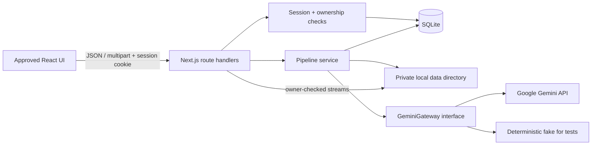
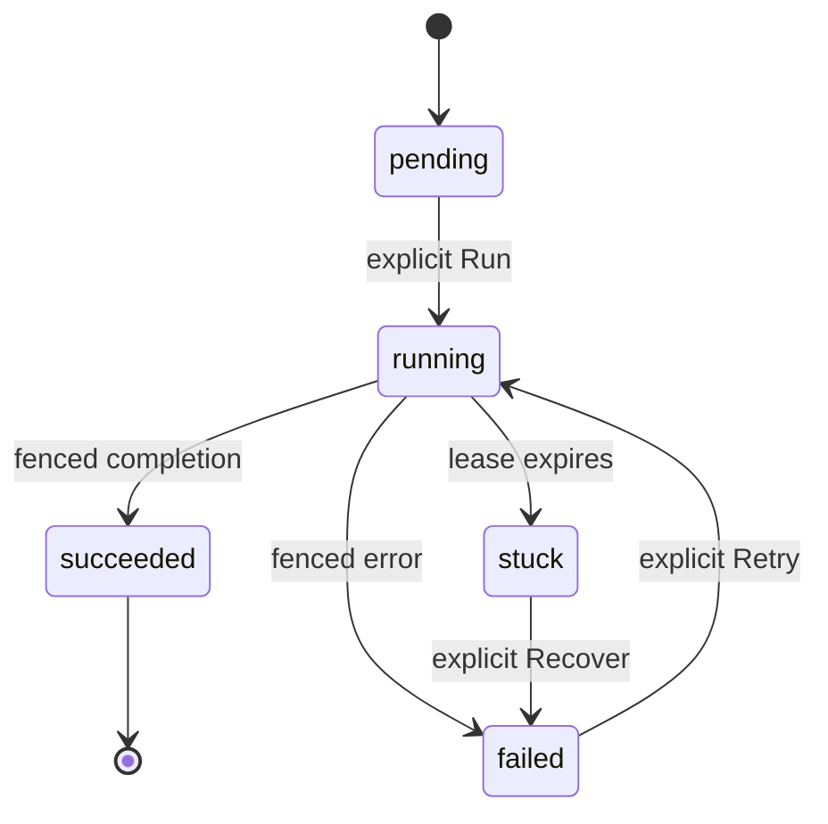

# Folio Book Studio — Assessment Completion Plan

> Status: implementation roadmap after the visual prototype was approved  
> Scope: finish the assessment-critical full stack without redesigning the UI again  
> Last verified against the Gradion brief and the official Gemini cookbook: 13 August 2026

## 1. Goal and success criteria

The current repository is a polished interactive prototype. The remaining work is to turn it into a real, local-only full-stack application that follows Google's book-illustration pipeline and is credible under refreshes, multiple tabs, failures, and process restarts.

The submission is ready only when all of the following are true:

- A reviewer can run the complete stack with `./start.sh` and all tests with `./test.sh`.
- Identity, projects, manuscript text, pipeline state, prompts, and artifacts are persisted outside the browser.
- All five stages use real Gemini calls in order: Style → Characters → Portraits → Chapters → Illustration.
- The manuscript is uploaded/sent to Gemini once; later stages reuse stored interaction context.
- The backend, not the browser, enforces a maximum of two adult characters and one chapter.
- Double-clicks, refreshes, and a second browser tab cannot start the same Gemini stage twice.
- A failed stage can be retried without destroying completed stages, and an expired run can be explicitly recovered.
- Portraits appear one at a time as they are persisted.
- The default test suite uses a fake Gemini adapter and never needs a key or spends quota.
- One real end-to-end Gemini run is completed locally and its actual output is recorded in `TESTING.md`.
- `DECISIONS.md`, AI artifacts, and Git history honestly show where AI helped, where it was challenged, and what trade-offs were accepted.

## 2. Current state and gaps

| Area | Current state | Required final state |
| --- | --- | --- |
| UI | Approved React/CSS prototype | Preserve visuals; connect every state to server data |
| Runtime | vinext/Cloudflare Worker-oriented starter | Local Node runtime with filesystem access |
| Identity | Client-only simulated sign-in | Name/email identity with an HttpOnly session cookie |
| Data | Seed objects and `localStorage` | SQLite records isolated by user/project |
| Pipeline | `setTimeout` and static sample artifacts | Real Gemini gateway and persisted five-stage state machine |
| Concurrency | One-tab UI guard | Atomic server-side claim, lease, and fencing token |
| Files | Static files in `public/` | Uploaded manuscript and generated images under a private local data directory |
| Errors | UI branches are mostly unreachable | Persisted failed and stuck states with explicit Retry/Recover |
| Tests | Build/string smoke tests | Backend state tests, frontend state tests, and mocked five-stage integration |
| Docs | Starter README | Submission-grade README, DECISIONS, TESTING, plan, architecture, and AI evidence |

The UI is no longer the main risk. From this point onward, spend time on correctness, integration, tests, and communication—not visual polish or bonus media.

## 3. Recommended architecture

### 3.1 Runtime and dependencies

Keep the approved React markup and CSS, but migrate the submission copy from vinext/Cloudflare to standard Next.js App Router on Node.js.

Why:

- The brief requires manuscript text and generated images on the local filesystem.
- A Worker runtime makes local disk persistence unnatural and conflicts with the local-only delivery requirement.
- Next.js route handlers let the existing UI, API, authenticated file serving, and pipeline runner live in one process.
- SQLite needs no Docker and gives credible transactions for duplicate-call protection.

Target dependencies:

- `next`, `react`, `react-dom`
- `better-sqlite3` and its TypeScript types
- `@google/genai`
- `zod`
- `vitest`, React Testing Library, `jsdom`, and an HTTP test utility if useful

Pin a compatible stable Next/React pair and Node 22. Every route that touches SQLite, files, or Gemini must declare `runtime = 'nodejs'` and `dynamic = 'force-dynamic'`; configure `serverExternalPackages: ['better-sqlite3']`. Bind the development server to `127.0.0.1`, not `0.0.0.0`. Self-host the existing licensed Fraunces/Geist WOFF2 files through `next/font/local` so a clean build does not depend on Google Fonts network access.

Remove after the migration is green:

- vinext, Wrangler, Cloudflare Vite plugins, Worker entry points, D1 starter examples, and the ChatGPT-hosting auth helper
- `.openai/hosting.json` and public-hosting configuration
- the obsolete source-string test and simulated-Gemini footer copy

Do not delete the approved visuals while migrating. First make the existing page render under the Node runtime, commit that baseline, and then replace simulated state incrementally.

### 3.2 System shape



Use polling approximately every 1.5 seconds only while a project has a running stage. SSE/WebSockets are a bonus and should not be implemented unless every required item is complete.

Construct database, clock, storage, and Gemini dependencies through a small `createServices(...)` composition root. Production creates one process singleton; every test constructs an isolated instance. Avoid module-level environment-bound test services, which become flaky under Vitest module caching.

### 3.3 Target repository layout

```text
app/
  api/
    session/route.ts
    projects/route.ts
    projects/[projectId]/route.ts
    projects/[projectId]/manuscript/route.ts
    projects/[projectId]/steps/[step]/run/route.ts
    projects/[projectId]/steps/[step]/recover/route.ts
    projects/[projectId]/characters/[characterId]/portrait/route.ts
    projects/[projectId]/chapters/[chapterId]/illustration/route.ts
  page.tsx
components/
  Identity.tsx
  Library.tsx
  NewProject.tsx
  Studio.tsx
lib/
  auth/session.ts
  db/client.ts
  db/migrate.ts
  db/queries.ts
  storage/files.ts
  validation/identity.ts
  validation/project.ts
  pipeline/state.ts
  pipeline/runner.ts
  pipeline/prompts.ts
  pipeline/types.ts
  gemini/gateway.ts
  gemini/google-gateway.ts
  gemini/fake-gateway.ts
migrations/001_init.sql
tests/backend/
tests/frontend/
tests/integration/
data/                     # ignored; created at runtime
docs/ai/                  # real prompts/transcript exports only
start.sh
test.sh
```

This is a target, not permission to split every component immediately. Extract code only when it enables a useful API boundary or test.

## 4. Persistence model

Use direct prepared SQL rather than keeping an ORM for seven small tables. Enable:

```sql
PRAGMA journal_mode = WAL;
PRAGMA foreign_keys = ON;
PRAGMA busy_timeout = 5000;
```

Store timestamps as epoch milliseconds and IDs as UUID text.

### 4.1 Tables

#### `users`

- `id` primary key
- `email` unique, case-insensitive, normalized before lookup
- `name`
- `created_at`, `updated_at`

Use a signed HttpOnly session cookie containing the stable user ID and expiry; no session table, password, or OAuth is needed. Keep a generated local-only `SESSION_SECRET` in `.env.local`, use SameSite=Lax, `Path=/`, a finite Max-Age, and `Secure` only over HTTPS. Validate same-origin on write requests. This mechanism satisfies the assessment's identity-continuity requirement; it is not proof that the visitor owns the email address. On a returning sign-in, update the stored display name to the latest submitted valid name.

#### `projects`

- `id`, `user_id`, `title`
- `manuscript_path`, `manuscript_original_name`, `manuscript_sha256`, `word_count`
- `gemini_file_name`, `gemini_file_uri`, `gemini_file_uploaded_at`
- `style_text`
- `created_at`, `updated_at`

Use `pipeline_steps.result_json` as the canonical checkpoint owner for step-level provider IDs: Step I holds book/style chain IDs, Step II the character-text ID, and Step IV the chapter-text ID. Each portrait/chapter artifact row owns its image interaction ID; derive the image tail from the latest successful ordinal. Do not duplicate these IDs on `projects`. Derive status precisely: Done iff all five steps succeeded; Draft iff no step has ever been attempted; In progress otherwise, including failed/stuck Stage I.

#### `pipeline_steps`

Create exactly five rows when a project is created.

- composite primary key: `project_id`, `step_no`
- `step_no` constrained to 1–5
- `status`: `pending | running | succeeded | failed`
- `attempt_count`
- `run_token`, `started_at`, `lease_expires_at`
- `completed_at`, `error_code`, `error_message`
- `interaction_id`, `result_json`, `updated_at`

#### `characters`

- `id`, `project_id`, `ordinal` constrained to 0–1
- `name`, `role`, `prompt`
- `portrait_status`, `portrait_path`, `portrait_mime`, `portrait_interaction_id`, `error_message`
- unique `project_id + ordinal`

#### `chapters`

- `id`, `project_id`, `ordinal` constrained to exactly 0
- `name`, `prompt`, `character_names_json`
- `illustration_status`, `illustration_path`, `illustration_mime`, `illustration_interaction_id`, `error_message`
- unique `project_id + ordinal`

Use `COLLATE NOCASE UNIQUE` for email; CHECK constraints for statuses and ordinals; `ON DELETE CASCADE` for owned rows; and an index on `projects(user_id, created_at DESC)`. The schema, service, and Gemini response schema all enforce the two-character/one-chapter caps. Do not rely on `slice()` in the UI. A separate attempt-history table/UI is P1 only; `attempt_count`, errors, and the current fencing token are enough for required behavior.

### 4.2 Local file layout

```text
data/
  folio.sqlite
  users/<userId>/projects/<projectId>/
    source.txt
    portraits/<generatedId>.<validated-extension>
    illustrations/<generatedId>.<validated-extension>
```

Rules:

- Never place a user-supplied filename in a storage path.
- Store relative paths in the database.
- Write to a temporary sibling file, then atomically rename.
- Resolve every path under `DATA_DIR` and reject traversal/prefix escape using `path.resolve` plus `path.relative`, not a string `startsWith` check.
- Derive `png`, `jpeg`, or `webp` extension only from validated returned MIME data.
- Do not expose `data/` through `public/`; stream files only from owner-checked API routes.
- Add `data/`, temporary artifacts, test data, and SQLite sidecar files to `.gitignore`.
- Add `!.env.example`, because the current `.env*` rule would otherwise ignore it.

## 5. API contract

| Method and route | Purpose |
| --- | --- |
| `POST /api/session` | Validate name/email, find or create the user, create session cookie |
| `GET /api/session` | Restore current identity after refresh |
| `DELETE /api/session` | Revoke session and sign out |
| `GET /api/projects` | Return only the signed-in user's projects with derived status/progress |
| `POST /api/projects` | Create from title plus exactly one `.txt` upload or pasted text |
| `GET /api/projects/:id` | Owner-scoped title/created date, manuscript text, five-step state, style, characters/prompts/portraits, and chapter/prompt/illustration |
| `GET /api/projects/:id/manuscript` | Return the complete readable manuscript to its owner |
| `POST /api/projects/:id/steps/:step/run` | Atomically claim and run the current stage; Stage I accepts optional style |
| `POST /api/projects/:id/steps/:step/recover` | Abandon an expired lease; never calls Gemini |
| `GET /api/projects/:id/characters/:characterId/portrait` | Owner-checked portrait stream |
| `GET /api/projects/:id/chapters/:chapterId/illustration` | Owner-checked chapter illustration stream |

Project creation validation:

- title is required and bounded
- exactly one source mode: file or pasted text
- uploaded source has a case-insensitive `.txt` extension and MIME `text/plain` or empty (common for browser uploads); all other extensions/types are rejected
- enforce the byte limit before decoding; decode with `TextDecoder('utf-8', { fatal: true })`; reject empty/whitespace-only text, NUL, and binary payloads
- bound and sanitize the title/original filename used only for display
- set a documented local limit such as 5 MB
- allocate server IDs, create the private directory, fsync a temporary source, atomically rename to `source.txt`, then transactionally create project + five step rows; remove the directory if the database transaction fails

Every project, manuscript, action, and artifact query must include the current user's ID. Returning a guessed ID from another account must be indistinguishable from not found.

Contract-test that the list DTO always includes title, created date, derived Draft/In progress/Done, and all five progress states. Contract-test that the detail DTO contains every field the brief requires. Returning email must load the existing projects, and same-origin validation must protect all cookie-authenticated writes.

## 6. Pipeline state, duplicate prevention, and recovery

### 6.1 State model



`stuck` is a derived view of `status=running AND lease_expires_at < now`; it does not need another stored enum.

### 6.2 Atomic stage claim

Run the claim inside `BEGIN IMMEDIATE`:

1. Verify project ownership and load the requested row.
2. If that row already succeeded, idempotently return its saved result.
3. Compute the first non-succeeded step and require the requested step to equal it; every earlier step must be succeeded.
4. If it is running with a live lease, return `202` with the existing state and make zero Gemini calls.
5. If it is running with an expired lease, return `409 STEP_STUCK` and make zero Gemini calls.
6. For pending/failed, create a UUID `run_token`, increment the attempt, mark it running, set a conservative fixed lease, and commit.
7. Only the request that successfully claimed the row may invoke the Gemini gateway.

Use `db.transaction(claimFn).immediate()` (or explicit `BEGIN IMMEDIATE/COMMIT/ROLLBACK`); a default deferred transaction is not enough. End the database transaction before any Gemini `await`.

Keep the execution model boring: the claimant's HTTP request awaits the runner while the UI polls persisted state concurrently. Do not add a queue or rely on an unobserved fire-and-forget promise. Do not pass the browser request's AbortSignal into the Gemini call. The claimant returns the updated DTO on success or a typed persisted failure; a duplicate live request returns `202`; expired/out-of-order requests return `409`.

Do not promise that an ordinary request-bound provider call survives every client disconnect. Keep all five stages as foreground request/response calls with durable local leases/checkpoints and verify refresh behavior in real UAT. If the preflight proves this insufficient for text timeouts, the narrowly scoped fallback is Gemini Interactions `background: true` for supported text models, `store: true`, immediate interaction-ID persistence, and reconciliation with `interactions.get` before chaining. Official background docs do not explicitly include the selected image model, so image stages remain foreground calls with fixed-lease/fencing recovery. Do not add a queue for this take-home.

### 6.3 Lease and fencing

- Use a conservative fixed lease longer than the measured maximum stage duration (initial default 180 seconds), configurable and testable with an injected clock.
- Success/failure writes and every partial checkpoint update only when the same run token still owns the row.
- When a persisted background text interaction ID exists, reconcile provider status before declaring it stuck; otherwise expiry exposes explicit recovery.

Fence character inserts, portrait status/path, image-tail IDs, chapter inserts, Stage V transition IDs, and artifact associations—not only terminal step writes. An old request that finishes after recovery cannot publish a late portrait or overwrite a new attempt. It may leave an unreferenced temporary image, but it cannot corrupt visible state; cleanup of orphan files can be a later improvement.

### 6.4 Explicit recovery

Recover is allowed only after lease expiry. It:

- records the old attempt as abandoned in the step's result/error metadata
- moves the step to a retryable failed state
- clears the lease/run token
- preserves all earlier stages and per-item artifacts
- makes no Gemini call

The user must then explicitly press Retry. There is never an automatic Gemini retry loop.

### 6.5 Honest limitation to document

SQLite ensures one local claimant across double-clicks, refreshes, and multiple tabs. However, Gemini does not provide an application idempotency key for this workflow. If the process dies after Gemini accepted a request but before its response/interaction ID was saved, upstream completion is ambiguous. Fencing prevents data corruption, but an explicit user retry may incur one extra provider call.

State this in `DECISIONS.md`; do not claim impossible distributed exactly-once behavior.

## 7. Gemini pipeline implementation

### 7.1 Verified references and model choice

Primary references:

- [Official Book Illustration notebook, pinned revision](https://github.com/google-gemini/cookbook/blob/f1e7e3de6004e6ca604b174684ecf89d628ac6c4/examples/Book_illustration.ipynb)
- [Interactions API overview](https://ai.google.dev/gemini-api/docs/interactions-overview)
- [Structured output](https://ai.google.dev/gemini-api/docs/structured-output)
- [Files API](https://ai.google.dev/gemini-api/docs/files)
- [Image generation](https://ai.google.dev/gemini-api/docs/image-generation)
- [Pricing](https://ai.google.dev/gemini-api/docs/pricing)

The current notebook defaults are:

```env
GEMINI_TEXT_MODEL=gemini-3.6-flash
GEMINI_IMAGE_MODEL=gemini-3.1-flash-lite-image
```

Use `gemini-3.6-flash` for text. For this submission, deliberately choose stable `gemini-3.1-flash-image` as the application default and record the deviation in `DECISIONS.md`: Google's current image guide describes it as the all-around model and it is better suited to multiple portrait references and character consistency. Keep `gemini-3.1-flash-lite-image` as an explicit lower-cost manual option because it is the literal notebook default, but never switch models automatically during a failed attempt. Do not use the retired `gemini-3.1-flash-image-preview` ID.

As of the verification date, the image models do not have an API free tier. At 1K output, the documented image output prices are approximately US$0.0336 per Lite image or US$0.067 per Flash image. The required maximum of two portraits plus one chapter illustration therefore has a base image-output cost around US$0.101 (Lite) or US$0.201 (Flash), plus input/text usage. Pricing and quotas can change; verify them again before the real run.

### 7.2 Gateway boundary

Define a small `GeminiGateway` interface with operations needed by the five stages. Implement:

- `GoogleGeminiGateway` for real calls
- `FakeGeminiGateway` for deterministic tests, controllable delays, malformed output, failures, interruptions, and per-item results

Configure every provider path for **one total attempt**. Its retry behavior must not silently turn one user action into several billed calls. A timeout becomes a persisted failure; only the user can retry.

Pin the JS SDK version and verify its two retry surfaces: use `httpOptions.retryOptions.attempts = 1` for Files/legacy client calls and pass the SDK's per-call “no retry” option (for the pinned version, for example `retries: { strategy: 'none' }`/`maxRetries: 0`) on every `interactions.create/get`. If the pinned API cannot guarantee this cleanly, use native REST `fetch` instead. Add an HTTP-level spy test proving one attempt per claimed sub-call.

Log metadata only: stage, project ID, attempt, model, interaction ID, elapsed time, and outcome. Never log the API key or full manuscript.

Treat the manuscript as untrusted data, not as instructions to the application. Keep pipeline instructions in the developer/system context, clearly delimit manuscript-derived content, re-specify supported interaction-scoped system/response/generation settings on every relevant call, and test a manuscript containing prompt-injection-like text. It must not be able to change caps, ordering, output schema, or file access. Use `service_tier: 'standard'`; do not opt into priority pricing.

Define and test the normal-path provider-operation budget. Durable checkpoints make a retry skip every already-completed operation:

| User-visible stage | Maximum provider operations |
| --- | --- |
| I · Style | one Files upload, one book interaction, one supplied/generated style interaction |
| II · Characters | one structured text interaction |
| III · Portraits | one image-context setup interaction, then at most two portrait interactions |
| IV · Chapter | one structured text interaction |
| V · Illustration | one final image interaction with the relevant local portrait references |

This distinction matters: the UI has five user-driven stages, but some stages deliberately contain several notebook-defined provider operations. Duplicate protection guarantees one runner and one copy of this sequence, not one raw HTTP request per stage.

### 7.3 Stage I — Style

1. Lazily upload the project's local `source.txt` through Gemini Files API only if no file reference is stored.
2. Persist the returned file name/URI immediately under the current run-token fence.
3. Create the initial book interaction with one document URI and the notebook's illustration context; persist `book_interaction_id` immediately under the same fence.
4. If the user left style empty, generate an appropriate style chained from the book interaction.
5. If the user supplied a style, send it through a quiet chained interaction so later turns retain it.
6. Persist the style text and style interaction ID.

Never send the full manuscript text in later stage prompts.

Stage I is resumable inside the stage: if a retry already has a persisted valid file URI, do not upload again; if it has `book_interaction_id`, do not recreate the book interaction. Continue from the latest durable sub-call checkpoint.

### 7.4 Stage II — Characters

- Chain from the Style text interaction with `previous_interaction_id`.
- Request structured JSON for the main adult characters only.
- Schema fields: `name`, `role`, `ageGroup`, `prompt`; `ageGroup` must be the literal `adult`, and each prompt should be richly descriptive and at least 50 words. The public card may omit `ageGroup`.
- Require 1–2 items, set schema `maxItems: 2`, validate with Zod, enforce the cap in service/database code, and reject—not silently slice—malformed, over-cap, or non-adult output.
- Persist the character rows and text interaction ID atomically.

### 7.5 Stage III — Portraits

- Start a separate image interaction containing the chosen style and persistent rules: one family-friendly illustration, no text, no title, no border, no multi-panel composition.
- Generate portraits sequentially so each interaction can follow the previous image interaction.
- Use an explicit image-only response, 1K output, and a 9:16 portrait ratio as this app's UX/cost decision; the current notebook leaves those response settings implicit.
- After each image returns: validate image content, write it atomically to disk, persist its path/mime/interaction ID, update the image-tail interaction ID, and expose progress immediately.
- If portrait two fails, keep portrait one. A retry generates only the missing portrait.
- If the image setup/tail checkpoint already exists, resume from it rather than recreating earlier image interactions.

### 7.6 Stage IV — Chapter

- Chain from the character-text interaction, not from a reconstructed prompt history.
- Request structured JSON with `name`, `prompt`, and `characterNames`.
- Request and enforce a maximum of one chapter.
- Validate referenced names against persisted characters before saving.

### 7.7 Stage V — Illustration

- Follow the notebook's explicit-reference consistency variant: make one fresh image interaction with the chapter prompt, style/rules, and the relevant 1–2 locally stored portrait images.
- Do not also chain from the portrait tail or create a transition interaction; combining both notebook alternatives duplicates context and provider work.
- Use an explicit image-only response, 1K output, and a documented 4:3 or 16:9 scene ratio.
- Save the final image to local disk and persist it exactly like the portraits.
- Mark the project Done only after the fifth step and its artifact are durably saved.

### 7.8 Provider-context expiry

Gemini Files are retained for 48 hours. Stored Interactions are retained for about one day on the free tier and, on paid tiers, 55 days by default with shorter configurable windows. Persist the file expiry time, explicitly use `store: true`, and verify provider resources rather than trusting non-null IDs. If context expired, return `CONTEXT_EXPIRED` and show **Rebuild Gemini context**. That user-confirmed action uploads the local book into a new provider context and rehydrates the required Style/Characters text chain from saved local outputs before retrying the current stage. Never rebuild silently or inside an automatic retry. Completed local artifacts survive; Stage V's explicit local portrait-reference path does not need the old image chain. Record and test this trade-off.

## 8. Frontend integration without another redesign

1. Create a typed API client and server DTOs.
2. Replace login state with `POST/GET/DELETE /api/session`.
3. Remove seeded projects and `localStorage` project persistence.
4. Connect Library to the project list endpoint; keep its existing empty, status, and progress visuals.
5. Submit New Volume as multipart data; preserve upload dialog and paste mode.
6. Connect Studio to the project detail DTO.
7. Map persisted states to the existing pipeline UI:
   - pending/current → clear stage action
   - running → named stage, disabled action, item counts, polling
   - failed → error and Retry current stage only
   - expired running → Recover affordance
   - succeeded → stored artifacts and prompts
   - all succeeded → Done
8. Keep full manuscript access available at every stage through its authenticated endpoint/modal.
9. Stop polling when no stage is running, the page unmounts, or the user signs out.
10. On a `202 already running` response, show the same persisted in-flight state; do not treat it as an error.

Maintain accessibility already added to the prototype: visible focus, modal focus return, useful live status, `aria-busy`, explicit step states, and keyboard-usable upload controls. Avoid making the entire workbench an overly noisy live region; announce only concise status changes.

## 9. Test strategy

### 9.1 Backend tests — highest scoring value

Write these against a temporary SQLite file, temporary data directory, fake clock, and fake Gemini gateway:

- email normalization and project isolation between two users
- project creation from paste and `.txt`; reject empty, binary, invalid UTF-8, wrong file type, both source modes, and oversized source
- exact step ordering and rejection of skipped/out-of-order stages
- server-side enforcement of two adults and one chapter after malformed/over-cap Gemini output
- two concurrent run requests using `Promise.all`: exactly one runner claim succeeds and the expected provider sub-call sequence occurs once
- refresh/second request while a lease is live returns the same in-flight state and zero new calls
- repository/service recreation against the same database preserves true state (simulated server restart)
- failure is persisted; Retry invokes only the current stage and keeps prior results
- no automatic retry after a provider failure
- fresh lease reports running; expired lease reports stuck
- recovery abandons only the expired attempt and preserves artifacts
- late completion with an old run token cannot overwrite a recovered/new attempt
- portrait one succeeds and portrait two fails: 1/2 remains visible; retry requests only portrait two
- all portrait artifacts are durable but the final Stage III status commit crashes: reconciliation completes the step without another image generation
- manuscript uploaded once; later stages receive interaction/reference IDs rather than manuscript content
- malformed structured JSON, missing image bytes, and over-cap responses fail safely
- authenticated artifact serving and path traversal rejection

For concurrency, assert one runner and one exact provider-operation sequence—not one total provider call for a compound stage. Stage I includes file upload + book/style text interactions; Stage II one structured text interaction; Stage III image setup plus up to two portraits; Stage IV one structured text interaction; Stage V one final image call with local portrait references. The concurrency/fencing and partial-portrait tests are the highest-signal technical tests in the submission.

### 9.2 Integration tests

- One complete five-stage happy path with Fake Gemini.
- Assert database state after every stage, all expected files on disk, exactly two character rows, one chapter row, and three generated images maximum.
- One failure → explicit retry path.
- One expired lease → recover → retry path with an old late completion rejected.

### 9.3 Frontend tests

Use React Testing Library for a deliberately small number of meaningful state tests:

- invalid/valid identity and session restoration
- empty Library plus Draft/In progress/Done and five-step progress
- New Volume file/paste validation and API error
- Studio ready, specifically named running stage, failed/Retry, stuck/Recover, and completed states
- disabled action while running and no duplicate submission on double-click
- first portrait appearing while the second is still running
- full manuscript modal focus, Escape close, and focus return

Do not spend time on pixel snapshots, CSS implementation details, Gemini service internals, real network calls in the default suite, or broad browser E2E. The brief explicitly does not expect E2E.

### 9.4 Test commands and report

`./test.sh` must:

- require no Gemini key
- create isolated temporary database/storage
- run lint, backend, frontend, integration tests, and production build
- clean temporary data on exit
- fail on the first failing command

`TESTING.md` must contain a real, unedited report including:

- command and date
- Node version and commit SHA
- mock/real environment
- suite/test counts and duration
- pasted terminal summary
- what was deliberately not tested and why

The real UAT appendix should also record selected model IDs, truncated interaction/file IDs, per-stage duration, provider-operation count, source-upload count, image count, and usage/cost metadata when available—never secrets or full manuscript content.

Add an opt-in real smoke command or documented manual flow, but never run a billed network test in CI or the default test command.

## 10. Required submission artifacts

### `README.md`

- product overview and screenshot
- prerequisites and supported Node version
- exact `./start.sh` and `./test.sh` commands
- environment table
- local architecture/data paths
- how mock tests differ from a real run
- troubleshooting for native SQLite, missing billing/model access, expired Gemini context, and port conflicts
- known limits, including the crash ambiguity described above
- no hosted demo link; the brief requires local-only operation

### `DECISIONS.md`

Write four to six real decisions as they happen. Each must say who proposed what, who challenged it, the final choice, and its cost. Required topics:

- Node runtime instead of keeping the Worker runtime
- SQLite/filesystem versus JSON files or a larger infrastructure stack
- separate ordered step state plus lease/run-token fencing
- Interactions API context chaining and explicit one-attempt SDK configuration
- polling versus SSE/WebSockets
- any model-quality/cost choice between Nano Banana 2 Lite and Nano Banana 2

At least three entries must be genuine AI overrides. Good candidates only if they truly happen:

- rejecting frontend-only locking because it cannot protect multiple tabs
- rejecting Redis/queues as over-engineering for a one-process local app
- rejecting automatic provider retries because every retry can spend quota
- rejecting repeated manuscript prompts in favor of stored file/interaction context
- correcting notebook output caps from its general example to the assessment's strict 2/1 contract

Do not backfill fictional disagreements. Close with a specific one-more-day answer.

### `TESTING.md`

Testing rationale, deliberate omissions, actual mock-suite report, and one real Gemini UAT report.

### AI artifacts

- `AGENTS.md` with the brief's constraints and project rules
- this implementation plan
- `docs/architecture.md` with the state/lease/context diagrams
- a short genuine notebook-preflight note with the date, selected models, and observed mechanics
- only real saved prompts, agent instructions, or transcript exports under `docs/ai/`
- never fabricate earlier prompts or hide AI-authored work

Update `DECISIONS.md` and save genuine AI evidence at the end of each phase, while the reasoning is fresh—not as a bulk documentation exercise in Phase 8. Add an asset-provenance note for AI-generated UI illustrations/mascot and any third-party fonts/assets.

### Start/test/env files

- executable `start.sh`: validate Node/env, migrate, and start Next.js on localhost; README runs deterministic `npm ci` once rather than silently installing unknown dependencies
- executable `test.sh`: fake Gemini + temporary storage, no key
- `.env.example` with placeholders/defaults only

## 11. Information needed from the candidate

### Required before the real Gemini run

1. Create a Gemini API key in [Google AI Studio](https://aistudio.google.com/apikey).
2. Put it directly into local `.env.local`:

   ```env
   GEMINI_API_KEY=your_key_here
   ```

3. Confirm the associated project has billing enabled and can access the chosen image model. Image generation currently has no API free tier. Set a small billing alert if available.
4. Check the project's current rate limits/quota in AI Studio.
5. Run the official Book Illustration notebook steps 1–5 personally, as the brief explicitly requires, and keep a short honest note of what was learned.

Never paste the key into chat, a screenshot, a commit, `TESTING.md`, or a transcript. If a key is ever exposed, revoke and replace it immediately.

### Optional candidate choices

- A small public-domain UTF-8 `.txt` manuscript for the final real run. The notebook's Wind in the Willows text is acceptable.
- Whether the final UAT should favor notebook fidelity/cost (`gemini-3.1-flash-lite-image`) or stronger multi-reference consistency (`gemini-3.1-flash-image`). Record the decision; do not switch models automatically.
- A personal maximum spend for the one real validation run. The app should still display the exact bounded work before generation.

The candidate does **not** need to provide model IDs, OAuth credentials, Google service-account JSON, a database URL, S3 credentials, or any secret to a reviewer. The repository supplies sensible model defaults and the reviewer adds their own `GEMINI_API_KEY` locally if they want to exercise real calls. All tests remain runnable without one.

Proposed `.env.example`:

```env
# Required only for a real Gemini run. Never commit a real value.
GEMINI_API_KEY=

# Current text model plus the deliberate quality-first image choice.
GEMINI_TEXT_MODEL=gemini-3.6-flash
GEMINI_IMAGE_MODEL=gemini-3.1-flash-image

# Local-only application settings.
DATA_DIR=./data
DATABASE_PATH=./data/folio.sqlite
SESSION_SECRET=replace-with-a-long-random-local-value
PORT=3000
STUCK_AFTER_MS=180000
```

## 12. Timeboxed implementation sequence

The following plan is approximately 15 focused hours from the approved UI, leaving about one hour of contingency. Stop bonus work immediately if any P0 item is incomplete.

| Phase | Budget | Work | Acceptance gate | Suggested commit |
| --- | ---: | --- | --- | --- |
| 0. Notebook + API preflight | 0.5h | Candidate runs official steps 1–5; verify model access, billing, and exact request shapes | One real notebook result and written observations; no key committed | `docs: record Gemini pipeline preflight` |
| 1. Runtime + harness | 1.25h | Migrate vinext to Next Node; add Vitest/RTL; retain approved UI | Clean install, dev render, lint, build, local fonts, one baseline test | `chore: move the prototype to a local Node runtime` |
| 2. Persistence + projects | 2.0h | Migration, SQLite, signed session, file storage, project CRUD | Two identities are isolated; `.txt` and paste survive restart | `feat: persist identities projects and manuscripts` |
| 3. State machine TDD | 2.0h | Ordering, atomic claim, fixed lease, fencing, retry/recovery tests + implementation | Concurrent callers produce one runner; stale completion rejected | `feat: add durable pipeline leases and recovery` |
| 4. Gemini gateway | 3.0h | Real/fake adapters, prompts, structured schemas, context chaining, per-image checkpointing | Gateway contract follows notebook; SDK retries disabled; fake failure modes work | `feat: implement the Gemini illustration pipeline` |
| 5. Routes + integration | 1.0h | Awaited run/recover orchestration and DTO contracts | Mock happy path completes all five stages and writes three images max | `test: cover the full five-stage pipeline` |
| 6. UI connection | 2.5h | Replace seeds/localStorage/timers with session/projects/API/polling | Existing UI handles refresh, second tab, running, failed, stuck, and item progress | `feat: connect the Folio UI to persisted pipeline state` |
| 7. Frontend tests | 1.0h | High-value component states and modal/upload behavior | Required FE state tests pass without network/quota | `test: cover critical user-facing pipeline states` |
| 8. Submission docs | 1.0h | Finish README, DECISIONS, TESTING, architecture, scripts, env example, AI artifacts already updated per phase | Reviewer instructions work from a clean clone | `docs: prepare the assessment handoff` |
| 9. Real UAT + rehearsal | 0.75h | One real pipeline; double-click/tab/refresh/process-kill tests; final cleanup | Real report captured, no secret/tracked data, clean clone rehearsal passes | `chore: complete final assessment verification` |

This totals about 15 focused hours and leaves roughly one hour of contingency. Add an hour-8 kill gate: the mocked pipeline through Stage V plus duplicate-call/recovery tests must pass. If it does not, cut CI, visible attempt history, component extraction, and all bonus work immediately—never docs, recovery, or core tests.

Implementation should remain in small commits. If a commit is mostly AI-authored, say so honestly in its body. Preserve the existing UI commit history; do not squash or rewrite it.

## 13. Manual UAT checklist

- New email creates an empty Library; returning email loads only that user's projects.
- Upload and pasted manuscripts both create projects; invalid files are clearly rejected.
- Full manuscript is readable before and after every stage.
- Stage buttons cannot skip order.
- Stage I works with a supplied style and a generated style.
- Double-click produces one attempt and one Gemini call.
- A second tab sees the same running stage and does not launch another call.
- Refresh during generation resumes the persisted view.
- Portrait one appears before portrait two completes.
- A provider failure leaves prior work intact and Retry runs only the failed stage.
- Killing the server mid-stage eventually shows Recover; Recover makes no Gemini call; explicit Retry is required.
- A late old completion cannot overwrite the recovered attempt.
- Signing out/in and restarting the server preserve state and artifacts.
- Another identity cannot retrieve the project, manuscript, or image by guessed ID.
- A manuscript containing text that tries to override the pipeline cannot change ordering, caps, output schema, or file access.
- Mobile 320 px and keyboard navigation retain usable actions and no horizontal overflow.
- No request, response, log, screenshot, documentation file, Git object, or browser bundle exposes `GEMINI_API_KEY`.

## 14. Risks and stop rules

| Risk | Mitigation |
| --- | --- |
| Runtime migration breaks the approved UI | Make migration-only commit first; no visual refactor in the same step |
| Native SQLite install fails on reviewer machine | Pin Node 22 LTS, verify clean `npm ci`; fall back to built-in `node:sqlite` only if proven necessary |
| SDK silently retries and spends quota | Explicitly configure one total attempt and assert call counts in fake-gateway tests |
| Gemini returns malformed/over-cap data | JSON schema + Zod + service/DB constraints; persist a clear failure |
| Server dies during provider call | Persist lease before call; expiry/recovery plus fencing; document upstream ambiguity honestly |
| File/context reference expires | Specific `CONTEXT_EXPIRED` error plus a visible, user-confirmed context rebuild; never resend silently |
| Image model quota/billing unavailable | Preflight before coding adapter; default tests remain completely mock-based |
| Single 1,300-line component makes integration risky | Extract only API-backed panels/state as needed; do not undertake a cosmetic component rewrite |
| Time runs short | Cut CI, attempt-history UI, sample books, SSE, Docker, and all bonus media before cutting any P0 behavior/test/doc |

## 15. Definition of done before sharing the repository

- `git status` clean and no generated `data/`, database, `.env.local`, or test artifacts tracked.
- `git grep` finds no API key and no “Gemini calls simulated” product copy.
- `./test.sh` succeeds from a clean clone with no key.
- `./start.sh` succeeds after adding a local key and opens only on localhost.
- README commands are copied and executed exactly as written.
- README explicitly explains that no Docker is needed because SQLite/filesystem storage are embedded, and discloses that manuscript content is sent to Gemini with provider retention implications; use non-sensitive/public-domain text for UAT.
- One real bounded pipeline succeeds and the real report is committed without secrets.
- `DECISIONS.md` contains 4–6 genuine decisions, at least three real AI overrides, and the one-more-day answer.
- AI artifacts are genuine, understandable, and safe to share.
- Caps, ordering, duplicate protection, retry, recovery, incremental portraits, ownership, and filesystem serving have direct test evidence.
- Any existing hosted preview is removed/unpublished; repository remote points to the final GitHub/GitLab/Bitbucket repository, reviewer access is confirmed, and no public application deployment is advertised.

## 16. Priority summary

### P0 — must ship

- local Node runtime
- SQLite + private filesystem persistence
- identity/project isolation
- real five-stage Gemini pipeline with one manuscript upload/context chain
- atomic duplicate protection, lease, fencing, retry, recovery
- per-portrait persistence
- backend + frontend + mocked integration tests
- one-command start/test
- README, DECISIONS, TESTING, env example, and authentic AI artifacts
- one real local pipeline report

### P1 — only if P0 is complete

- CI running the mock suite
- visible attempt history
- small public-domain sample selector
- SSE instead of polling

### Explicitly skip

- public deployment
- Redis, queues, microservices, Docker without a demonstrated need
- OAuth/passwords
- S3/blob/CDN storage
- automatic Gemini retries
- Veo, Lyria, TTS, audiobook, or other later notebook sections
- another UI redesign

The most impressive submission is not the one with the most features. It is the one whose polished UI is backed by a small, testable system that tells the truth under concurrency, failure, refresh, and restart—and whose Git history and decisions show that the candidate, not the AI, owned those trade-offs.
